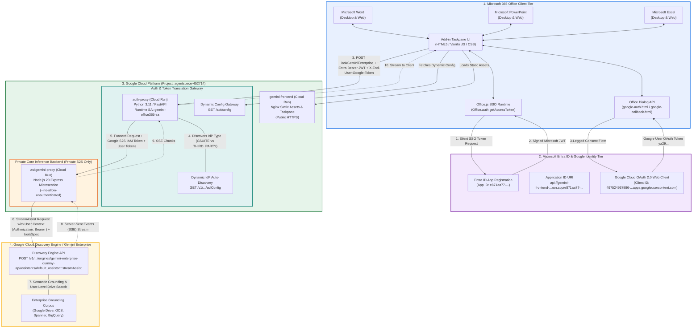
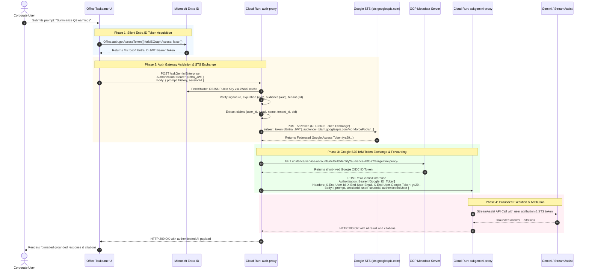
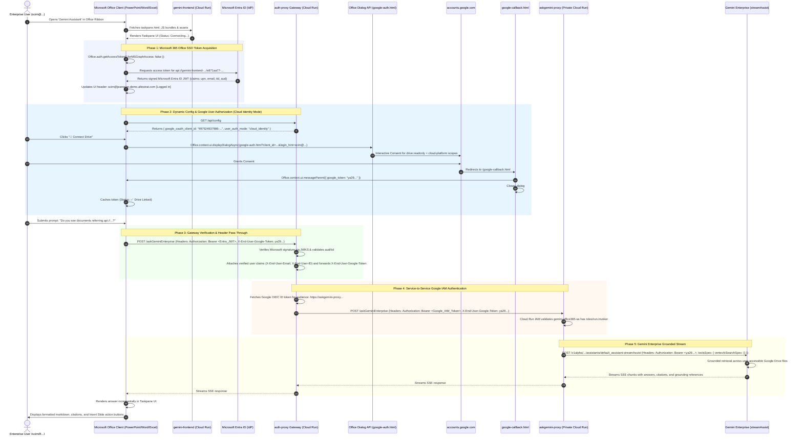
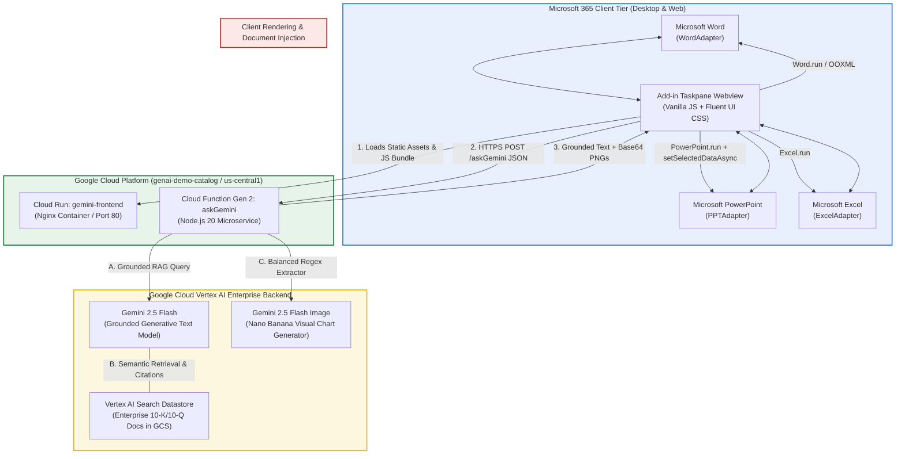
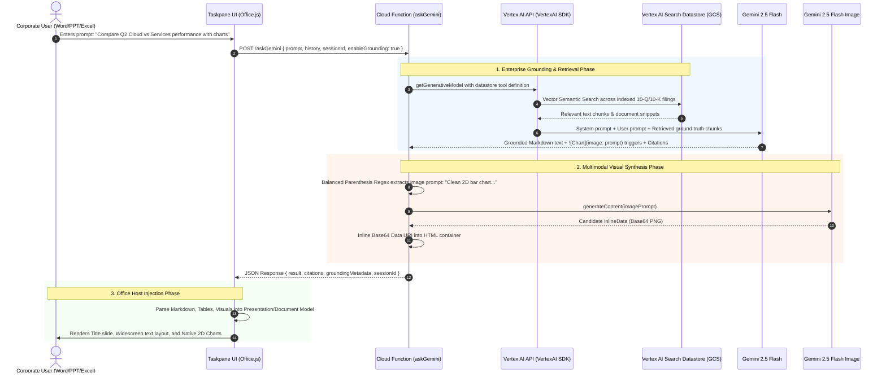
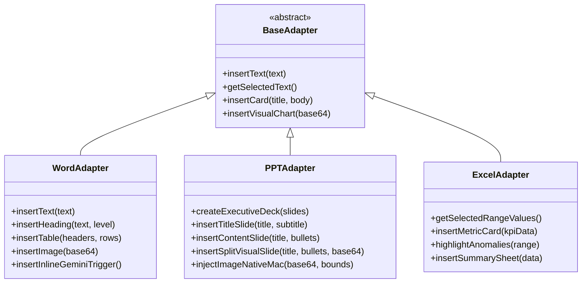
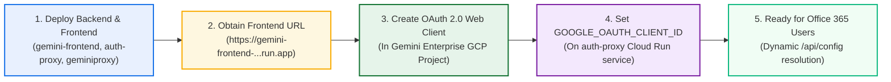

# Architecture & System Design: Gemini for Microsoft 365
**Author:** Carlos Augusto, Principal Architect, Google  
**License:** Apache-2.0  

---

## 📑 Executive Summary

**Gemini for Microsoft 365** is an enterprise-grade AI integration platform that connects Microsoft Office client applications (**Word**, **PowerPoint**, and **Excel**) with **Google Cloud Vertex AI**.

The system combines:
1. **Factual Enterprise Grounding** via **Vertex AI Search Datastores** (RAG over enterprise 10-K/10-Q filings, policies, and internal docs).
2. **Generative Intelligence** via **Gemini 2.5 Flash** for multi-turn conversational reasoning and content synthesis.
3. **Multimodal Visual Synthesis** via **Gemini 2.5 Flash Image** (Nano Banana) for dynamic 2D flat vector financial charts and infographics.
4. **Native Host Adapters** for Microsoft Word (inline `@gemini` insertion, text transformation), PowerPoint (multi-slide executive decks with native macOS WKWebView dual-pipeline image rendering), and Excel (range analysis, anomaly detection, KPI metric cards).

> 📖 **Decoupled Auth & S2S System Architecture:** For a deep dive into the decoupled Microsoft Entra ID authentication gateway, Google Cloud Service-to-Service IAM model, and implementation blueprints, see [DEVELOPER_ARCHITECTURE_GUIDE.md](DEVELOPER_ARCHITECTURE_GUIDE.md) and [DEPLOYMENT_INSTRUCTIONS.md](DEPLOYMENT_INSTRUCTIONS.md).

---

## 🏛️ Enterprise Multi-Tier Architecture (Milestones 2 & 3)

The enterprise deployment separates concerns into dedicated, independently scalable, least-privilege tiers across **Microsoft 365**, **Microsoft Entra ID**, and **Google Cloud Platform**:



---

## 🔄 End-to-End Execution Flows

The platform supports two distinct identity execution paths depending on enterprise IdP configuration.

### Track 1: Workforce Identity Federation (WIF) Silent Token Exchange

In Track 1, users experience seamless Single Sign-On with zero Google login prompts. Their Microsoft Entra ID JWT is exchanged on the fly for a Google STS federated token via RFC 8693.



---

### Track 2: Cloud Identity 3-Legged Google User OAuth & S2S IAM

The sequence below illustrates the complete token acquisition, dynamic configuration retrieval, 3-legged Google user authorization, service-to-service IAM minting, and streaming grounding lifecycle:



---

## 🔒 Key Architectural Principles & Invariants

### 1. The Office.js SSO Domain-Matching Rule
Microsoft Office Add-in SSO requires that the **`<SourceLocation>`** domain, the **`<WebApplicationInfo><Resource>`**, and the **Entra ID Application ID URI** match identically:
$$\text{Domain in } \langle\text{SourceLocation}\rangle \equiv \text{Domain in } \langle\text{Resource}\rangle \equiv \text{Entra ID Application ID URI}$$

* **Frontend Hosting URL:** `https://gemini-frontend-16933400417.us-central1.run.app/taskpane.html`
* **Manifest `<Resource>`:** `api://gemini-frontend-16933400417.us-central1.run.app/b990d644-e47b-4575-97b3-2067c488042b`
* **Entra ID Application ID URI:** `api://gemini-frontend-16933400417.us-central1.run.app/b990d644-e47b-4575-97b3-2067c488042b`

If the Application ID URI points to a backend or proxy domain (`auth-proxy`), Office detects a domain mismatch and immediately triggers **Office SSO Error 13007: Invalid resource Url specified in the manifest**.

### 2. Pre-Authorized Client Applications in Entra ID
To enable silent SSO without consent prompts across all Office platforms, the following 3 client IDs must be pre-authorized under **Expose an API**:
1. `ea5a67f6-b6f3-4338-b240-c655ddc3cc8e` (Microsoft Office on the Web - Word/PPT/Excel Online)
2. `d3590ed6-52b3-4102-aeff-aad2292ab01c` (Office on the Web Companion / Outlook)
3. `00000002-0000-0ff1-ce00-000000000000` (Microsoft Office Desktop Client across macOS & Windows)

### 3. Decoupled Token Translation & Least Privilege
* **No Direct Internet Access to Core Backend:** `askgemini-proxy` is locked down with `--no-allow-unauthenticated`.
* **Runtime Service Account Identity:** `auth-proxy` runs as `gemini-office365-sa@agentspace-452714.iam.gserviceaccount.com` and only holds:
  - `roles/logging.logWriter` (Structured Cloud Logging)
  - `roles/discoveryengine.viewer` (Dynamic `aclConfig` auto-discovery)
  - `roles/run.invoker` on Cloud Run service `askgemini-proxy` (Private S2S communication)

---



---

## 🔍 Deep Dive: Vertex AI Search Datastore & Grounding

Enterprise financial analysis and corporate decision-making require **zero hallucination**, **deterministic factual accuracy**, and **strict citation traceability**. The platform implements Google Cloud's native Vertex AI Search Grounding architecture.



### 1. Grounding Configuration & Tool Definition
In `gemini-o365-proxy/index.js`, grounding is configured via the Vertex AI Generative Model `tools` schema:

```javascript
const modelConfig = {
  model: 'gemini-2.5-flash',
  systemInstruction: {
    parts: [{ text: SYSTEM_INSTRUCTION_TEXT }]
  },
  generationConfig: {
    temperature: 0.4,
    maxOutputTokens: 8192
  }
};

if (enableGrounding && DATASTORE_ID) {
  modelConfig.tools = [
    {
      retrieval: {
        vertexAiSearch: {
          datastore: process.env.VERTEX_DATASTORE_ID // Format: projects/PROJECT_ID/locations/global/collections/default_collection/dataStores/DATASTORE_ID
        }
      }
    }
  ];
}
```

### 2. How Grounding Guarantees Precision
1. **Document Ingestion:** Unstructured enterprise files (SEC 10-K, 10-Q filings, earnings releases, board presentations) are ingested from Google Cloud Storage (`gs://...`) into the **Vertex AI Search Datastore**.
2. **Chunking & Hybrid Search:** Vertex AI Search creates dense vector embeddings alongside sparse lexical search indexes.
3. **Retrieval-Augmented Generation (RAG):** When a user asks a question, Vertex AI automatically queries the datastore, extracts top-k relevant passages, and feeds them into the Gemini 2.5 Flash attention context.
4. **Citation Extraction:** Grounding metadata, chunk references, and URI citations are returned alongside the response and rendered as verifiable footnotes in the Office taskpane.

---

## 🎨 Multimodal Visual Pipeline (gemini-2.5-flash-image)

When users request visual charts, graphs, or executive diagrams, the system utilizes a dual-model generation pipeline:

```mermaid
graph LR
    UserPrompt[User Prompt: 'Show revenue chart'] --> GeminiFlash[Gemini 2.5 Flash]
    GeminiFlash -->|Outputs Directive| Directive["![Chart](image: A modern 2D financial bar chart... ($94.5B)...)"]
    Directive --> BalancedParser[Balanced Parenthesis Parser]
    BalancedParser -->|Clean Prompt| NanoBanana[Gemini 2.5 Flash Image / Nano Banana]
    NanoBanana -->|Raw Base64 PNG| DataUriEmbedder[HTML & Base64 Inliner]
    DataUriEmbedder --> TaskpaneResponse[Taskpane / Host Document]
```



### Balanced Parenthesis Prompt Parser
Financial chart prompts frequently contain embedded currency and accounting numbers in parentheses (e.g. `Google Services ($94.54B)`). Standard regular expressions fail on nested parentheses. The proxy backend implements a stack-based counter parser:

```javascript
// Stack-based balanced parenthesis prompt extraction
const startMarkerRegex = /!\[([^\]]*)\]\((?:image:|image-prompt:|imagen:)\s*/gi;
while ((match = startMarkerRegex.exec(processed)) !== null) {
  let openCount = 1;
  let i = contentStartIndex;
  while (i < processed.length && openCount > 0) {
    if (processed[i] === '(') openCount++;
    else if (processed[i] === ')') openCount--;
    i++;
  }
  if (openCount === 0) {
    const prompt = processed.substring(contentStartIndex, i - 1).trim();
    // Generate high-resolution 2D image via Vertex AI
  }
}
```

---

## 🖥️ Client-Side Host Adapter Architecture

The add-in uses a polymorphic adapter pattern (`HostAdapterFactory`) to dynamically bind to the running Office application:



### 🍎 The macOS WKWebView Dual-Pipeline Solution (PowerPoint)

#### The Problem:
On macOS, PowerPoint executes Office add-ins inside a sandboxed `WKWebView`. Passing large base64 image data (>50KB) through `PowerPoint.run` shape APIs triggers an XPC buffer serialization failure in the macOS window server, silently dropping the image.

#### The Dual-Pipeline Architecture:
1. **Slide Creation & Geometry:** Inside `PowerPoint.run`, the slide, header, and left-hand text shapes (width `420px`) are created and committed.
2. **Slide Selection Bridge:** The engine reads `newSlide.id` and synchronizes the active viewport:
   ```javascript
   context.presentation.setSelectedSlides([newSlide.id]);
   await context.sync();
   ```
3. **Native Office Common API Injection:** The engine immediately calls the lower-level C++ Office Common API:
   ```javascript
   Office.context.document.setSelectedDataAsync(base64Image, {
     coercionType: Office.CoercionType.Image,
     imageLeft: 480,
     imageTop: 110,
     imageWidth: 440,
     imageHeight: 340
   });
   ```
This bypasses macOS XPC serialization constraints and provides 100% reliable image insertion across all macOS and Windows Office versions.

---

## 🔒 Security, Compliance & Deployment Model

```mermaid
graph TD
    subgraph EnterpriseBoundary ["Google Cloud Enterprise Boundary"]
        subgraph IAM ["Cloud IAM & Policies"]
            ServiceAccount["Cloud Run / GCF Service Account<br/>(roles/aiplatform.user)"]
        end
        
        subgraph Services ["Deployed Services"]
            Frontend["gemini-frontend (Cloud Run)<br/>Region: us-central1"]
            Backend["askGemini (Cloud Functions Gen 2)<br/>Region: us-central1"]
            DatastoreRes["Vertex AI Search Datastore<br/>Collection: default_collection"]
        end
    end
    
    OfficeClient["Microsoft 365 Client<br/>(Word / PPT / Excel)"] -->|HTTPS (TLS 1.3)| Frontend
    OfficeClient -->|HTTPS JSON (CORS)| Backend
    Backend -->|Native IAM Token| DatastoreRes
```

1. **Zero Secret Storage:** No API keys or static credentials reside in client code or manifests. Authentication to Vertex AI and Gemini Enterprise is handled through Google Cloud IAM Service Account delegation and user-consented OAuth tokens.
2. **Data Residency:** All prompt tokens, document embeddings, and generated visuals remain strictly contained within the Google Cloud project (`jeansson-gem-ent-ci`, `us-central1`).
3. **CORS Hardened:** Strict CORS headers allow legitimate Microsoft 365 webview origins while blocking unauthenticated third-party scrapers.

---

## ⚙️ Deployment Ordering & OAuth Client Dependencies

When deploying the solution for an environment with **Cloud Identity / Google Workspace Identity**:



### Why Deployment Ordering Matters:
* **Redirect URI & Origin Dependency:** The Google OAuth 2.0 Web Client credentials must specify the exact JavaScript Origin (`https://gemini-frontend-...run.app`) and Redirect URI (`https://gemini-frontend-...run.app/google-callback.html`). These values are only known once the frontend Cloud Run service is deployed.
* **Dynamic Configuration Delivery:** By passing `GOOGLE_OAUTH_CLIENT_ID` to `auth-proxy` as an environment variable, the Office 365 add-in dynamically retrieves it at runtime via `/api/config`, preventing any static credential baking or build rebuilds when migrating across environments.

