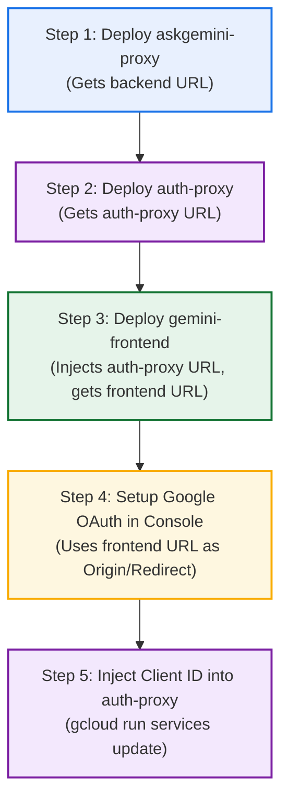

# Gemini for Microsoft 365 — End-to-End Deployment & Setup Runbook

**Author:** Carlos Augusto, Principal Architect, Google  
**License:** Apache-2.0  

This runbook is the complete, single-source-of-truth guide for deploying and configuring **Gemini for Microsoft Office 365** (Word, PowerPoint, Excel) on **Google Cloud Platform** and **Microsoft Entra ID**.

---

## 🧭 Table of Contents

### Core Architecture & Identity
1. [Architectural Overview & Track Selection](#1-architectural-overview--track-selection)
2. [Live Configuration Matrix & Reference Examples](#2-live-configuration-matrix--reference-examples)
3. [The Dual Authentication Boundary Model](#3-the-dual-authentication-boundary-model)
4. [Deployment Prerequisites & Required IAM Roles](#4-deployment-prerequisites)

### 🚀 Step-by-Step Installation Instructions
5. [Phase 1: Microsoft Entra ID Setup (Fork by Identity Mode)](#5-phase-1-microsoft-entra-id-setup-fork-by-identity-mode)
6. [Phase 2: Google Cloud IAM & Service Account Provisioning](#6-phase-2-google-cloud-iam--service-account-provisioning)
7. [Phase 3: Deploying Cloud Run Microservices](#7-phase-3-deploying-cloud-run-microservices)
   - [Track 1: Workforce Identity Federation (WIF)](#track-1-workforce-identity-federation-wif-deployment)
   - [Track 2: Cloud Identity / Google Workspace (3-Legged OAuth)](#track-2-cloud-identity--google-workspace-deployment)
8. [Phase 4: Office Add-in Manifest (Metadata XML) Customization](#8-phase-4-office-add-in-manifest-metadata-xml-customization)
9. [Phase 5: Sideloading & Distributing the Add-in](#9-phase-5-sideloading--distributing-the-add-in)

### 📚 Appendices & Reference Material
- [Appendix A: Verification, Testing & GCP Cloud Logging](#appendix-a-verification-testing--gcp-cloud-logging)
- [Appendix B: Cross-Project Deployment (Optional)](#appendix-b-cross-project-deployment-optional--only-required-if-gemini-enterprise-is-in-a-different-gcp-project)
- [Appendix C: Cloud Run Environment Variables Reference](#appendix-c-cloud-run-environment-variables-reference)

---

## 1. Architectural Overview & Track Selection

This solution supports two production identity and deployment patterns:

```
┌────────────────────────────────────────────────────────────────────────────────────────┐
│ Track 1: Workforce Identity Federation (WIF)                                           │
│ 👤 User Flow: Pure Microsoft 365 Entra ID SSO. Zero Google login prompts.              │
│ 🔄 Mechanism: Entra ID JWT exchanged on the fly via Google STS for temporary tokens.  │
│ 🎯 Best For: Customers who configured Gemini Enterprise to use WIF as the auth method. │
└────────────────────────────────────────────────────────────────────────────────────────┘

┌────────────────────────────────────────────────────────────────────────────────────────┐
│ Track 2: Cloud Identity / Google Workspace                                             │
│ 👤 User Flow: Entra ID secures the Add-in perimeter + 3-Legged Google User OAuth.      │
│ 🔄 Mechanism: User signs into Google once to search personal/shared Google Drive docs.  │
│ 🎯 Best For: Customers who configured Gemini Enterprise to use Cloud Identity.         │
└────────────────────────────────────────────────────────────────────────────────────────┘
```

---

## 2. Live Configuration Matrix & Reference Examples

| Configuration Parameter | Track 1: Workforce Identity Federation (WIF) | Track 2: Cloud Identity / Google Workspace |
| :--- | :--- | :--- |
| **GCP Cloud Run Project** | `agentspace-wif` (`1062675944253`) | `agentspace-452714` (`16933400417`) |
| **Discovery Engine (`GE_GCP_PROJECT_ID`)** | `agentspace-wif` | `jeansson-gem-ent-ci` |
| **Discovery Engine Location (`GE_GCP_LOCATION`)** | `global` | `us` |
| **Discovery Engine App ID (`GEMINI_ENTERPRISE_APP_ID`)** | `instance-demos1_1774616568648` | `gemini-enterprise-dummy-ap_1787693913560` |
| **Entra ID App ID (`MICROSOFT_ENTRA_APP_ID`)** | `85fb5428-6249-4131-9eeb-f2436d5d4d8c` | `e871aa77-54f7-4310-a549-cad3b1edee4a` |
| **Entra ID Tenant ID (`MICROSOFT_ENTRA_TENANT_ID`)** | `464c0986-459d-42b9-a68d-aff41ccd3b16` (`5m4qby.onmicrosoft.com`) | `8ea14f5d-d857-4ceb-b0f5-7e27b174f795` |
| **User Authentication (`USER_AUTH_MODE`)** | `auto` (or `wif`) | `cloud_identity` |
| **Google OAuth Web Client ID (`GOOGLE_OAUTH_CLIENT_ID`)** | *Not Required* | `497524937986-66oh05fskrkufpv2he7fb00fmpd4nlt9.apps.googleusercontent.com` |
| **WIF Audience / Workforce Pool** | `//iam.googleapis.com/locations/global/workforcePools/<POOL_ID>/providers/<PROVIDER_ID>`<br>*(Reference: `//iam.googleapis.com/locations/global/workforcePools/ca-entra-id-oidc-pool/providers/entra-id-oidc-pool-provider`)* | *None (Not used)* |
| **Office Manifest XML File** | [`manifest-wif.xml`](manifest-wif.xml) | [`manifest-gsuite.xml`](manifest-gsuite.xml) |
| **User Interaction** | **Zero Google Prompts** (Automatic SSO) | User clicks "Login with Google" once per session |

---

## 3. The Dual Authentication Boundary Model

### Why Entra ID Configuration is Still Required in GSuite Mode

When using Google (GSuite) authentication for document grounding, Microsoft Entra ID is still required because there are **two separate security boundaries** that must be enforced:

```
┌────────────────────────────────────────────────────────────────────────────────────────┐
│ 1. Microsoft 365 Client Tier (Office App & Webview)                                    │
│    👤 User: AlexW@5m4qby.onmicrosoft.com                                              │
│    🔑 Auth Mechanism: Microsoft Entra ID SSO (Office.auth.getAccessToken)              │
└───────────────────────────────────────────┬────────────────────────────────────────────┘
                                            │ (Passes Microsoft Bearer Token)
                                            ▼
┌────────────────────────────────────────────────────────────────────────────────────────┐
│ 2. GCP Ingestion & API Gateway Tier (`auth-proxy` on Cloud Run)                        │
│    🛡️ Gateway Defense: "Is this request coming from an authorized employee in our M365  │
│                       tenant using our approved Office Add-in?"                       │
└───────────────────────────────────────────┬────────────────────────────────────────────┘
                                            │ (Passes Google User OAuth Token ya29...)
                                            ▼
┌────────────────────────────────────────────────────────────────────────────────────────┐
│ 3. Google Gemini Enterprise Tier (Discovery Engine / Google Drive)                     │
│    👤 User: caugusto@google.com                                                        │
│    🔑 Auth Mechanism: Google 3-Legged OAuth                                            │
│    🎯 Purpose: "Which Google Drive files and Cloud Identity permissions does user have?"│
└────────────────────────────────────────────────────────────────────────────────────────┘
```

1. **Zero-Trust API Gateway Protection (`auth-proxy`)**:
   - Without Entra ID, anyone on the public internet discovering the `auth-proxy` URL could invoke your backend.
   - Entra ID ensures only requests from your verified Microsoft 365 Tenant (`MICROSOFT_ENTRA_TENANT_ID`) and registered App (`MICROSOFT_ENTRA_APP_ID`) can enter your Google Cloud environment.
2. **Native Office SSO (`<WebApplicationInfo>`)**:
   - Microsoft Office requires Entra ID to authenticate the desktop client silently (`Office.auth.getAccessToken()`) without repeated popup prompts.
3. **Data Authorization vs. Ingestion Security**:
   - **Entra ID** controls **service ingestion** into Cloud Run.
   - **Google OAuth (`ya29...`)** controls **data authorization** to personal Google Workspace / Drive files in Discovery Engine.

---

## 4. Deployment Prerequisites

Before beginning, ensure you have:

### 1. Google Cloud Platform
- A GCP Project with billing enabled and the `gcloud` CLI installed and authenticated (`gcloud auth login`).
- **Deployer Identity IAM Permissions:** The engineer or CI/CD identity executing these deployment steps requires:
  - `roles/run.admin` (Deploy, manage, and configure Cloud Run services)
  - `roles/cloudbuild.builds.editor` (Submit and execute Cloud Build container builds from source)
  - `roles/storage.admin` (or `roles/storage.objectAdmin`) (Upload source tarballs to Cloud Build staging buckets)
  - `roles/artifactregistry.admin` (Store and manage container images)
  - `roles/iam.serviceAccountAdmin` (Create and manage the runtime service account `gemini-office365-sa`)
  - `roles/iam.serviceAccountUser` (Attach `gemini-office365-sa` to Cloud Run services)
  - `roles/resourcemanager.projectIamAdmin` (Grant project-level IAM roles to the service account)
  - `roles/serviceusage.serviceUsageAdmin` (Enable required Google Cloud APIs)
  *(Alternatively, `roles/editor` or `roles/owner` combined with `roles/resourcemanager.projectIamAdmin`).*
- **Required GCP APIs Enabled:**
  ```bash
  gcloud services enable run.googleapis.com \
                         cloudbuild.googleapis.com \
                         artifactregistry.googleapis.com \
                         iam.googleapis.com \
                         discoveryengine.googleapis.com \
                         logging.googleapis.com \
                         sts.googleapis.com
  ```

### 2. Microsoft 365 / Entra ID
- Access to the [Microsoft Entra Admin Center](https://entra.microsoft.com/) with permissions to create or manage **App Registrations** (*Application Administrator* or *Global Administrator*).
- A Microsoft 365 tenant for testing (Word, PowerPoint, Excel on Web or Desktop).

---

# 🚀 Installation Instructions / Steps

## 5. Phase 1: Microsoft Entra ID Setup (Fork by Identity Mode)

Depending on whether you are deploying **Track 1 (WIF)** or **Track 2 (Cloud Identity / Google Workspace)**, choose the appropriate starting path below:

### 🔀 Step 1: App Registration Strategy (Fork)

#### Path A: If Using Track 1 (Workforce Identity Federation - WIF)
> [!NOTE]
> **Do NOT create a new App Registration.**  
> When setting up Google Cloud Workforce Identity Federation (WIF) with Microsoft Entra ID, your organization already created an Entra ID App Registration for the WIF workforce pool.
1. Navigate to the **[Microsoft Entra Admin Center](https://entra.microsoft.com/) > Identity > Applications > App registrations**.
2. Locate and open your **existing WIF App Registration**.
3. Copy and save the **Application (client) ID** and **Directory (tenant) ID**.

#### Path B: If Using Track 2 (Cloud Identity / Google Workspace)
> [!NOTE]
> **Create a new, dedicated App Registration for the Office Add-in.**
1. Navigate to the **[Microsoft Entra Admin Center](https://entra.microsoft.com/) > Identity > Applications > App registrations**.
2. Click **+ New registration**.
3. Configure:
   - **Name:** `Gemini-Office-365-Addin`
   - **Supported account types:** Select *Accounts in any organizational directory (Any Microsoft Entra ID tenant - Multitenant)* OR *Accounts in this organizational directory only (Single tenant)*.
   - **Redirect URI:** Select `Single-page application (SPA)` and leave blank for now.
4. Click **Register**. Copy and save the **Application (client) ID** and **Directory (tenant) ID**.

---

### Step 2: Configure API Permissions
1. In your App Registration sidebar, click **API permissions**.
2. Click **+ Add a permission** > **Microsoft Graph** > **Delegated permissions**.
3. Ensure the following basic delegated permissions are present:
   - `openid` (Sign users in)
   - `profile` (View basic profile)
   - `email` (View email address)
   - `User.Read` (Sign in and read user profile)
4. Click **Add permissions**.
5. Click **Grant admin consent for [Your Organization]** (if you have tenant admin rights).

---

### Step 3: Configure Token Versioning (v2.0)
1. In the App Registration sidebar, click **Manifest**.
2. Locate the `"requestedAccessTokenVersion"` property (around line 25 or under the `"api"` block).
3. Change its value from `null` or `1` to `2`:
   ```json
   "requestedAccessTokenVersion": 2,
   ```
4. Click **Save**.

> [!WARNING]
> Google STS and modern JWT validators require OAuth 2.0 v2 tokens issued by `https://login.microsoftonline.com/<tenant>/v2.0`. Setting version 2 prevents HTTP 400 token exchange errors.

---

### Step 4: Configure Optional Claims for Access Tokens
1. In the sidebar, click **Token configuration**.
2. Click **+ Add optional claim**.
3. Select **Token type:** `Access`.
4. Check the following claims:
   - `email`
   - `upn`
   - `preferred_username`
5. Click **Add**. If prompted to enable Microsoft Graph permissions for email/profile, check the consent box and confirm.

> [!NOTE]
> **Why Optional Claims are required:**
> - For **WIF**: Google STS maps the user identity using `google.subject = assertion.email`. If `email` is absent, STS throws an attribute mapping error.
> - For **Cloud Identity**: `auth-proxy` extracts `preferred_username` and `email` to identify the corporate user.

---

### Step 5: Post-Deployment Step: Set Application ID URI, Scope & Authorize Office Clients

> [!IMPORTANT]
> **URL Dependency Note:** The **Application ID URI** requires the public domain of your `gemini-frontend` Cloud Run service (e.g. `api://gemini-frontend-XXXXX.us-central1.run.app/<CLIENT_ID>`).  
> If you are setting up for the first time, proceed to **Phase 2 (IAM)** and **Phase 3 (Deploy Services)** below first. Once `gemini-frontend` is deployed and you know its HTTPS URL, return here to complete these steps:

1. In the App Registration sidebar, click **Expose an API**.
2. Next to **Application ID URI**, click **Set** (or **Edit**):
   ```text
   api://<your-gemini-frontend-domain>/<YOUR_APPLICATION_CLIENT_ID>
   ```
   *Example:* `api://gemini-frontend-1062675944253.us-central1.run.app/85fb5428-6249-4131-9eeb-f2436d5d4d8c`
3. Click **+ Add a scope**:
   - **Scope name:** `access_as_user`
   - **Who can consent:** `Admins and users`
   - **Admin consent display name:** `Access Gemini as User`
   - **Admin consent description:** `Allows Microsoft 365 Office apps to call Gemini backend on behalf of the user.`
   - **State:** `Enabled`
4. Click **Add scope**.
5. Under **Authorized client applications**, click **+ Add a client application** and add the following known Microsoft Office client GUIDs for the `access_as_user` scope:

| Client Application Name | Application (Client) ID |
| :--- | :--- |
| **Office on the Web (Word / PPT / Excel Web)** | `ea5a67f6-b6f3-4338-b240-c655ddc3cc8e` |
| **Office on the Web (WAC/Outlook)** | `d3590ed6-52b3-4102-aeff-aad2292ab01c` |
| **Office Desktop (Word / PPT / Excel Win/Mac)** | `00000002-0000-0ff1-ce00-000000000000` |
| **Microsoft Office (Unified)** | `bc59ab01-8403-45c6-8796-ac3ef710b3e3` |

6. Click **Grant admin consent for [Your Organization]** to ensure seamless SSO without individual user consent prompts.

---

## 6. Phase 2: Google Cloud IAM & Service Account Provisioning

Create a unified runtime service account for the Cloud Run services:

```bash
# Set your target project ID
PROJECT_ID="YOUR_GCP_PROJECT_ID"
gcloud config set project ${PROJECT_ID}

# 1. Create the unified runtime service account
gcloud iam service-accounts create gemini-office365-sa \
  --display-name="Gemini Office 365 Unified Service Account" \
  --project=${PROJECT_ID}

# 2. Grant Discovery Engine Editor
gcloud projects add-iam-policy-binding ${PROJECT_ID} \
  --member="serviceAccount:gemini-office365-sa@${PROJECT_ID}.iam.gserviceaccount.com" \
  --role="roles/discoveryengine.editor"

# 3. Grant Cloud Logging Writer
gcloud projects add-iam-policy-binding ${PROJECT_ID} \
  --member="serviceAccount:gemini-office365-sa@${PROJECT_ID}.iam.gserviceaccount.com" \
  --role="roles/logging.logWriter"
```

> [!NOTE]
> **Organization Policy Check:** If your Google Cloud organization enforces `constraints/iam.allowedPolicyMemberDomains`, ensure it is overridden at the project level to allow public (`allUsers`) invocation for `gemini-frontend` and `auth-proxy`.

---

## 7. Phase 3: Deploying Cloud Run Microservices

Deployment follows a strict 3-tier sequence:
1. **Tier 3: `askgemini-proxy`** (Backend inference & Discovery Engine connector)
2. **Tier 1: `gemini-frontend`** (Static Office web host & taskpane bundle)
3. **Tier 2: `auth-proxy`** (Authentication gateway & JWT validator)

---

### Track 1: Workforce Identity Federation (WIF) Deployment

#### Step 1: Deploy Backend Proxy (`askgemini-proxy`)
```bash
cd geminiproxy

gcloud run deploy askgemini-proxy \
  --source . \
  --project YOUR_WIF_GCP_PROJECT_ID \
  --region us-central1 \
  --service-account gemini-office365-sa@YOUR_WIF_GCP_PROJECT_ID.iam.gserviceaccount.com \
  --allow-unauthenticated \
  --set-env-vars "\
GE_GCP_PROJECT_ID=YOUR_WIF_GCP_PROJECT_ID,\
GE_GCP_LOCATION=global,\
GEMINI_ENTERPRISE_APP_ID=YOUR_GEMINI_ENTERPRISE_APP_ID,\
BACKEND_MODE=streamassist,\
ENTERPRISE_COLLECTION_ID=default_collection,\
ENTERPRISE_ASSISTANT_ID=default_assistant,\
ALLOW_SERVICE_ACCOUNT_FALLBACK=true" \
  --quiet
```

#### Step 2: Deploy Frontend Host (`gemini-frontend`)
```bash
cd ../microsoft-addin

gcloud run deploy gemini-frontend \
  --source . \
  --project YOUR_WIF_GCP_PROJECT_ID \
  --region us-central1 \
  --service-account gemini-office365-sa@YOUR_WIF_GCP_PROJECT_ID.iam.gserviceaccount.com \
  --set-env-vars "GEMINI_PROXY_URL=https://auth-proxy-YOUR_PROJECT_NUM.us-central1.run.app/askGeminiEnterprise" \
  --allow-unauthenticated \
  --quiet
```

#### Step 3: Deploy Auth Gateway (`auth-proxy`)
```bash
cd ../authproxy

gcloud run deploy auth-proxy \
  --source . \
  --project YOUR_WIF_GCP_PROJECT_ID \
  --region us-central1 \
  --allow-unauthenticated \
  --service-account gemini-office365-sa@YOUR_WIF_GCP_PROJECT_ID.iam.gserviceaccount.com \
  --set-env-vars "\
GE_GCP_PROJECT_ID=YOUR_WIF_GCP_PROJECT_ID,\
GE_GCP_LOCATION=global,\
MICROSOFT_ENTRA_APP_ID=YOUR_MICROSOFT_ENTRA_CLIENT_ID,\
DOWNSTREAM_BACKEND_URL=https://askgemini-proxy-YOUR_PROJECT_NUM.us-central1.run.app,\
USER_AUTH_MODE=auto,\
VERBOSE_LOGGING=true,\
WIF_AUDIENCE=//iam.googleapis.com/locations/global/workforcePools/YOUR_POOL/providers/YOUR_PROVIDER" \
  --quiet
```

---

### Track 2: Cloud Identity / Google Workspace Deployment

When Gemini Enterprise is configured with **Cloud Identity / Google Workspace Identity** (`idpType: GSUITE`), document search (such as personal/shared Google Drive files) requires an authorized Google user credential. This track uses **3-Legged Google User OAuth** where users sign into Google directly from within the Microsoft Office 365 taskpane.

To avoid circular URL dependencies, deployment follows a clean 5-step linear flow:



---

#### Step 1: Deploy Backend Proxy (`askgemini-proxy`)
```bash
cd geminiproxy

gcloud run deploy askgemini-proxy \
  --source . \
  --project YOUR_GCP_PROJECT_ID \
  --region us-central1 \
  --service-account gemini-office365-sa@YOUR_GCP_PROJECT_ID.iam.gserviceaccount.com \
  --allow-unauthenticated \
  --set-env-vars "\
GE_GCP_PROJECT_ID=YOUR_GEMINI_ENTERPRISE_PROJECT_ID,\
GE_GCP_LOCATION=us,\
STREAM_ASSIST_ENDPOINT_LOCATION=us,\
GEMINI_ENTERPRISE_APP_ID=YOUR_GEMINI_ENTERPRISE_APP_ID,\
BACKEND_MODE=streamassist,\
ENTERPRISE_COLLECTION_ID=default_collection,\
ENTERPRISE_ASSISTANT_ID=default_assistant,\
ALLOW_SERVICE_ACCOUNT_FALLBACK=true" \
  --quiet
```

> [!NOTE]
> Note the live URL returned by Cloud Run (e.g., `https://askgemini-proxy-16933400417.us-central1.run.app`). You will use this in Step 2 as `DOWNSTREAM_BACKEND_URL`.

---

#### Step 2: Deploy Auth Gateway (`auth-proxy`)
Deploy `auth-proxy` pointing downstream to `askgemini-proxy`. *(You will inject the `GOOGLE_OAUTH_CLIENT_ID` in Step 5 after creating the web client in the Google Cloud Console).*

```bash
cd ../authproxy

gcloud run deploy auth-proxy \
  --source . \
  --project YOUR_GCP_PROJECT_ID \
  --region us-central1 \
  --allow-unauthenticated \
  --service-account gemini-office365-sa@YOUR_GCP_PROJECT_ID.iam.gserviceaccount.com \
  --set-env-vars "\
MICROSOFT_ENTRA_APP_ID=YOUR_MICROSOFT_ENTRA_CLIENT_ID,\
MICROSOFT_ENTRA_TENANT_ID=YOUR_MICROSOFT_ENTRA_TENANT_ID,\
DOWNSTREAM_BACKEND_URL=https://askgemini-proxy-YOUR_PROJECT_NUM.us-central1.run.app,\
GE_GCP_PROJECT_ID=YOUR_GEMINI_ENTERPRISE_PROJECT_ID,\
GE_GCP_LOCATION=us,\
USER_AUTH_MODE=cloud_identity,\
REQUIRE_ENTRA_AUTH=true,\
VERBOSE_LOGGING=true" \
  --quiet
```

> [!NOTE]
> Note the live URL returned by Cloud Run (e.g., `https://auth-proxy-16933400417.us-central1.run.app`). You will use this in Step 3 as `GEMINI_PROXY_URL`.

---

#### Step 3: Deploy Frontend Host (`gemini-frontend`)
Deploy the static taskpane web bundle, injecting the live `auth-proxy` URL from Step 2:

```bash
cd ../microsoft-addin

gcloud run deploy gemini-frontend \
  --source . \
  --project YOUR_GCP_PROJECT_ID \
  --region us-central1 \
  --service-account gemini-office365-sa@YOUR_GCP_PROJECT_ID.iam.gserviceaccount.com \
  --set-env-vars "GEMINI_PROXY_URL=https://auth-proxy-YOUR_PROJECT_NUM.us-central1.run.app/askGeminiEnterprise" \
  --allow-unauthenticated \
  --quiet
```

> [!IMPORTANT]
> **Note your Live Frontend URL**: Note the HTTPS URL returned by Cloud Run (e.g., `https://gemini-frontend-16933400417.us-central1.run.app`). You will need this exact URL in Step 4 to configure Google OAuth Authorized JavaScript Origins and Redirect URIs.

---

#### Step 4: Setup Google OAuth 2.0 Web Client (in Gemini Enterprise GCP Project)

Navigate to the Google Cloud Project hosting your **Gemini Enterprise / Discovery Engine instance** (e.g., `jeansson-gem-ent-ci`).

##### 1. Configure OAuth Consent Screen & Audience
1. In the Google Cloud Console, navigate to **APIs & Services** ➔ **OAuth consent screen**  
   *(Direct link: `https://console.cloud.google.com/apis/credentials/consent`)*
2. Select **User Type:** **Internal** *(Allows all users within your Google Workspace / Cloud Identity domain to sign in immediately without unverified app warnings)*.
3. Click **Create**.
4. **App Information:**
   - **App name:** `Gemini Enterprise for Office 365`
   - **User support email:** Select your administrator email.
   - **Developer contact information:** Enter your administrator email.
5. Click **Save and Continue**.

##### 2. Configure Data Access (Scopes)
1. Under **Data Access / Scopes** (or **APIs & Services** ➔ **OAuth consent screen** ➔ **Data Access**):
2. Click **Add or Remove Scopes**.
3. Select the standard identity scopes:
   - `.../auth/userinfo.email`
   - `.../auth/userinfo.profile`
   - `openid`
4. In the **Manually add scopes** text box at the bottom, paste the required API scopes:
   ```text
   https://www.googleapis.com/auth/cloud-platform,https://www.googleapis.com/auth/drive.readonly
   ```
5. Click **Add to Table**, then click **Update**, and click **Save and Continue**.

| Scope URL | Scope Type | Purpose in Office 365 Integration |
| :--- | :--- | :--- |
| `openid` | OpenID Connect | Authenticates the user's Google profile |
| `https://www.googleapis.com/auth/userinfo.email` | Identity | Captures the primary user email |
| `https://www.googleapis.com/auth/userinfo.profile` | Identity | Captures the user's display name |
| `https://www.googleapis.com/auth/cloud-platform` | Core GCP | Authorizes Discovery Engine `streamAssist` API execution |
| `https://www.googleapis.com/auth/drive.readonly` | Google Drive | Read-only search & RAG grounding on user's Google Drive files |

##### 3. Create OAuth 2.0 Web Client ID
1. In the left navigation menu, go to **Credentials**  
   *(Direct link: `https://console.cloud.google.com/apis/credentials`)*
2. Click **+ CREATE CREDENTIALS** at the top ➔ Select **OAuth client ID**.
3. Fill in the required fields:
   - **Application type:** Select **Web application**.
   - **Name:** `Gemini Office 365 Web Client`
   - **Authorized JavaScript origins:**  
     Click **+ ADD URI** and enter your deployed `gemini-frontend` URL from Step 3:
     ```text
     https://gemini-frontend-YOUR_PROJECT_NUM.us-central1.run.app
     ```
   - **Authorized redirect URIs:**  
     Click **+ ADD URI** and enter the dedicated callback endpoint:
     ```text
     https://gemini-frontend-YOUR_PROJECT_NUM.us-central1.run.app/google-callback.html
     ```
4. Click **CREATE**.
5. Copy the generated **Client ID** (e.g., `497524937986-66oh05fskrkufpv2he7fb00fmpd4nlt9.apps.googleusercontent.com`).

---

#### Step 5: Inject Google OAuth Client ID into `auth-proxy`

Update `auth-proxy` with the generated `GOOGLE_OAUTH_CLIENT_ID`. The gateway dynamically serves this Client ID to the taskpane via `/api/config` (zero hardcoding in client bundles):

```bash
gcloud run services update auth-proxy \
  --project YOUR_GCP_PROJECT_ID \
  --region us-central1 \
  --update-env-vars "GOOGLE_OAUTH_CLIENT_ID=YOUR_GOOGLE_OAUTH_CLIENT_ID" \
  --quiet
```

> [!IMPORTANT]
> **Next Step: Finalize Microsoft Entra ID & Manifest URLs**  
> Now that your Cloud Run microservices are deployed and you have their live HTTPS URLs:
> 1. **Return to Microsoft Entra ID ([Phase 1, Step 5](#step-5-post-deployment-step-set-application-id-uri-scope--authorize-office-clients)):** Set the **Application ID URI** to `api://<your-gemini-frontend-domain>/<YOUR_APPLICATION_CLIENT_ID>`, create the `access_as_user` scope, and pre-authorize the Microsoft Office client application IDs.
> 2. **Customize your Office XML Manifest ([Phase 4](#8-phase-4-office-add-in-manifest-metadata-xml-customization)):** Update `<SourceLocation>`, `<IconUrl>`, `<WebApplicationInfo><Id>`, and `<WebApplicationInfo><Resource>` with the exact values from your deployment below.

---

## 8. Phase 4: Office Add-in Manifest (Metadata XML) Customization

Before distributing or sideloading the Add-in, you must generate or customize the metadata XML manifest. You can generate it automatically using the interactive script (Option 1) or update the template manually (Option 2).

---

### Option 1: Automated Generation via Interactive Script (Recommended)

Run the built-in generator script. It will interactively prompt for your deployment track, your Cloud Run `gemini-frontend` URL, and your Microsoft Entra Client ID:

```bash
# Run interactive generator
python3 scripts/generate_manifest.py
```

Alternatively, generate it directly via CLI flags:

```bash
# Track 1 (Workforce Identity Federation - WIF):
python3 scripts/generate_manifest.py \
  --track wif \
  --frontend-url https://gemini-frontend-YOUR_PROJECT_NUM.us-central1.run.app \
  --client-id YOUR_MICROSOFT_ENTRA_CLIENT_ID \
  --output manifest-wif-custom.xml

# Track 2 (Cloud Identity / Google Workspace):
python3 scripts/generate_manifest.py \
  --track gsuite \
  --frontend-url https://gemini-frontend-YOUR_PROJECT_NUM.us-central1.run.app \
  --client-id YOUR_MICROSOFT_ENTRA_CLIENT_ID \
  --output manifest-gsuite-custom.xml
```

---

### Option 2: Manual Manifest Customization

If editing the XML files manually ([`manifest-wif.xml`](manifest-wif.xml) or [`manifest-gsuite.xml`](manifest-gsuite.xml)), update the following metadata elements:

#### Field-by-Field Manifest Reference Table

| XML Element / Attribute | What to Update | Why It Must Be Updated | Example Value |
| :--- | :--- | :--- | :--- |
| `<Id>` *(top-level GUID)* | Unique Add-in GUID | Identifies the add-in in the Office catalog. If deploying both WIF and GSuite or running multiple environments (dev/prod), **each manifest must have a distinct GUID** so they do not overwrite each other on the Office ribbon. | `6b9f4a12-8923-4d32-bb15-99d9b89e9001` |
| `<ProviderName>` | Your Organization Name | Displayed in Microsoft 365 Admin Center and the Add-in info dialog to identify the publisher. | `Google Cloud Architecture Team` |
| `<DisplayName DefaultValue="...">` | Add-in Display Title | The label displayed beneath the icon on the Microsoft Word/PowerPoint/Excel Home ribbon. | `Gemini Assistant (WIF)` |
| `<Description DefaultValue="...">` | Add-in Description | Summary displayed to users when browsing uploaded add-ins in Office. | `Enterprise Gemini Assistant powered by Vertex AI` |
| `<IconUrl>` / `<HighResolutionIconUrl>` | URL to icon assets | HTTPS URLs pointing to your `gemini-frontend` Cloud Run service where `icon-32.png` and `icon-80.png` are hosted. | `https://gemini-frontend-1062675944253.us-central1.run.app/assets/icon-32.png` |
| `<SourceLocation DefaultValue="...">` | Taskpane HTML entrypoint | The exact HTTPS URL of `taskpane.html` hosted on `gemini-frontend`. Office loads this URL inside the webview iframe. | `https://gemini-frontend-1062675944253.us-central1.run.app/taskpane.html` |
| `<AppDomains>` | Whitelisted domain origins | Microsoft Office restricts network calls from the Add-in webview. You must list your `gemini-frontend` domain so Office allows navigation and API calls. | `<AppDomain>https://gemini-frontend-1062675944253.us-central1.run.app</AppDomain>` |
| `<bt:Url id="msg.Taskpane.Url" DefaultValue="...">` | Taskpane URL resource string | Office manifest uses resource string tables. Must match `<SourceLocation>`. | `https://gemini-frontend-1062675944253.us-central1.run.app/taskpane.html` |
| `<WebApplicationInfo><Id>` | Microsoft Entra App (Client) ID | Links the Office client to your Microsoft Entra ID App Registration. Office passes this Client ID to `login.microsoftonline.com` when requesting silent SSO access tokens. | `85fb5428-6249-4131-9eeb-f2436d5d4d8c` |
| `<WebApplicationInfo><Resource>` | Application ID URI | Must **exactly match** the Application ID URI configured in Microsoft Entra ID (Phase 1, Step 2). Office validates this against the token `aud` (audience) claim. | `api://gemini-frontend-1062675944253.us-central1.run.app/85fb5428-6249-4131-9eeb-f2436d5d4d8c` |
| `<WebApplicationInfo><Scopes><Scope>` | OAuth Permission Scope | **CRITICAL: Must have exactly ONE scope: `access_as_user`**. Microsoft Office manifest validation **fails immediately** if more than one `<Scope>` is declared or if the scope name does not match Entra ID. | `<Scope>access_as_user</Scope>` |

#### Common Manifest Configuration Errors & Impacts

| Mistake | Manifest Validation / Runtime Symptom | Resolution |
| :--- | :--- | :--- |
| **Mismatched `<Resource>` vs Entra ID Application ID URI** | Office SSO fails with `13003 (The user is not enabled for SSO)` or `13005 (The add-in doesn't support the requested SSO scope)`. | Verify `<Resource>` in the XML matches the exact Application ID URI in Entra ID (e.g., `api://gemini-frontend-.../CLIENT_ID`). |
| **Multiple `<Scope>` tags under `<WebApplicationInfo>`** | Office rejects the manifest upon upload with error: *"Manifest XML format error: only one scope allowed under WebApplicationInfo"*. | Keep exactly one `<Scope>access_as_user</Scope>`. |
| **Using `http://` instead of `https://`** | Office rejects manifest upload immediately. | All endpoints (`SourceLocation`, `IconUrl`, `AppDomains`) must use valid `https://`. |
| **Duplicate top-level `<Id>` GUID** | Uploading a second add-in with the same GUID silently replaces the first add-in or throws an upload conflict in M365 Admin Center. | Generate a fresh GUID (via `uuidgen` in terminal) for each distinct manifest file. |

---

## 9. Phase 5: Sideloading & Distributing the Add-in

Once your manifest XML file is ready, choose one of the following deployment methods:

### Option A: Sideloading in Office on the Web (Fastest for testing & validation)
1. Open [Word for the Web](https://word.office.com), [PowerPoint for the Web](https://powerpoint.office.com), or [Excel for the Web](https://excel.office.com).
2. Go to the top ribbon: **Insert** ➔ **Add-ins** ➔ **Upload My Add-in** (or **Manage My Add-ins**).
3. Browse and select your customized manifest XML file (e.g., `manifest-wif-custom.xml` or `manifest-gsuite-custom.xml`).
4. Click **Upload**. The **Gemini Assistant** button will appear immediately on the **Home** ribbon.

### Option B: Centralized Enterprise Rollout via Microsoft 365 Admin Center (Production Rollout)
To deploy the Add-in across your entire organization or targeted security groups without requiring individual end users to sideload:
1. Sign in to the **[Microsoft 365 Admin Center](https://admin.microsoft.com/)** as a Global Administrator or Exchange Administrator.
2. Navigate to **Settings** ➔ **Integrated apps** ➔ **Upload custom apps**.
3. Choose **Upload manifest file (.xml) from device** and select your customized manifest XML.
4. Assign users (*Entire organization*, *Specific users/groups*, or *Just me for pilot*).
5. Review and accept permissions, then finish the deployment wizard.
6. For a complete visual walkthrough and best practices, refer to **[MICROSOFT_365_ADMIN_CENTER_DEPLOYMENT.md](MICROSOFT_365_ADMIN_CENTER_DEPLOYMENT.md)**.

---

# 📚 Appendices & Reference Material

---

## Appendix A: Verification, Testing & GCP Cloud Logging

### 1. Verify Service Health & Endpoints
```bash
# 1. Test auth-proxy Health
curl -s https://auth-proxy-YOUR_PROJECT_NUM.us-central1.run.app/health
# Response: {"status":"healthy","service":"auth-proxy",...}

# 2. Test auth-proxy Config
curl -s https://auth-proxy-YOUR_PROJECT_NUM.us-central1.run.app/api/config
# Response: {"auth_mode":"auto","google_oauth_client_id":...}

# 3. Test askgemini-proxy Health
curl -s https://askgemini-proxy-YOUR_PROJECT_NUM.us-central1.run.app/
# Response: {"status":"healthy","backend":"askgemini-proxy",...}
```

### 2. Viewing Live Structured Logs in Google Cloud Logging
```bash
# Stream live Cloud Run logs for auth-proxy
gcloud logging tail "resource.type=cloud_run_revision AND resource.labels.service_name=auth-proxy"

# Stream live Cloud Run logs for backend proxy
gcloud logging tail "resource.type=cloud_run_revision AND resource.labels.service_name=askgemini-proxy"
```

---

## Appendix B: Cross-Project Deployment (Optional — Only Required if Gemini Enterprise is in a Different GCP Project)

When the **Cloud Run microservices** (`auth-proxy`, `askgemini-proxy`, `gemini-frontend`) are deployed in one GCP project (e.g., `PROJECT_A`), but the **Gemini Enterprise (Discovery Engine) instance** resides in a different GCP project (e.g., `PROJECT_B`), cross-project IAM access must be granted.

### Option A: Configure Cross-Project Access via `gcloud` (Recommended)

Run the following commands as an **Owner** or **IAM Admin** on the **Gemini Enterprise target project (Project B)**:

```bash
# Set your target project and Cloud Run service account
TARGET_GEMINI_PROJECT="YOUR_GEMINI_ENTERPRISE_PROJECT_ID"
CLOUD_RUN_SERVICE_ACCOUNT="YOUR_SERVICE_ACCOUNT@YOUR_CLOUD_RUN_PROJECT_ID.iam.gserviceaccount.com"

# 1. Grant Discovery Engine Editor access on the Gemini Enterprise project
gcloud projects add-iam-policy-binding "${TARGET_GEMINI_PROJECT}" \
  --member="serviceAccount:${CLOUD_RUN_SERVICE_ACCOUNT}" \
  --role="roles/discoveryengine.editor"

# 2. Grant Service Usage Consumer permission on the Gemini Enterprise project
gcloud projects add-iam-policy-binding "${TARGET_GEMINI_PROJECT}" \
  --member="serviceAccount:${CLOUD_RUN_SERVICE_ACCOUNT}" \
  --role="roles/serviceusage.serviceUsageConsumer"
```

### Option B: Configure via Google Cloud Console
1. Navigate to the **Gemini Enterprise GCP Project** in the [Google Cloud Console](https://console.cloud.google.com/).
2. Go to **IAM & Admin** ➔ **IAM** ➔ Click **+ Grant Access**.
3. **New principals**: Enter the Cloud Run service account (`YOUR_SERVICE_ACCOUNT@YOUR_CLOUD_RUN_PROJECT_ID.iam.gserviceaccount.com`).
4. **Assign roles**:
   - `Discovery Engine Editor` (`roles/discoveryengine.editor`)
   - `Service Usage Consumer` (`roles/serviceusage.serviceUsageConsumer`)
5. Click **Save**.

### Cloud Run Service Configuration for Cross-Project:
Set the following environment variables on the `askgemini-proxy` and `auth-proxy` Cloud Run services in Project A:
- `GE_GCP_PROJECT_ID`: Target project ID hosting Gemini Enterprise (e.g., `YOUR_GEMINI_ENTERPRISE_PROJECT_ID`)
- `GEMINI_ENTERPRISE_APP_ID`: Target Engine/App ID (e.g., `YOUR_GEMINI_ENTERPRISE_APP_ID`)
- `GE_GCP_LOCATION`: Location of collection/engine resource (`global`, `us`, or `eu`)
- `STREAM_ASSIST_ENDPOINT_LOCATION`: Regional API endpoint prefix (`global`, `us`, or `eu`)

---

## Appendix C: Cloud Run Environment Variables Reference

Complete reference for all environment variables supported across the three microservices, including requirement level, default fallback values, descriptions, and concrete examples for both **Track 1 (WIF)** and **Track 2 (GSuite)**.

### 1. `auth-proxy` (FastAPI Python Gateway)

| Variable Name | Required / Optional | Default Value | Track 1 (WIF) Example | Track 2 (GSuite) Example | Description & Impact |
| :--- | :---: | :---: | :--- | :--- | :--- |
| `MICROSOFT_ENTRA_APP_ID` | **Required** | `""` | `85fb5428-6249-4131-9eeb-f2436d5d4d8c` | `e871aa77-54f7-4310-a549-cad3b1edee4a` | Entra ID Application (Client) ID. Must match the client ID in your Office manifest `<WebApplicationInfo>`. |
| `DOWNSTREAM_BACKEND_URL` | **Required** | `""` | `https://askgemini-proxy-1062675944253.us-central1.run.app` | `https://askgemini-proxy-16933400417.us-central1.run.app` | Target HTTPS URL of the downstream `askgemini-proxy` Cloud Run service. |
| `GE_GCP_PROJECT_ID` | Optional | `agentspace-452714` | `agentspace-wif` | `jeansson-gem-ent-ci` | Google Cloud project hosting Discovery Engine / Gemini Enterprise. |
| `GE_GCP_LOCATION` | Optional | `global` | `global` | `us` | Location of Discovery Engine resources (`global`, `us`, `eu`). |
| `USER_AUTH_MODE` | Optional | `auto` | `auto` (or `wif`) | `cloud_identity` | Authentication protocol mode: `wif` (Entra ID token exchanged with Google STS), `cloud_identity` (3-legged Google OAuth), or `auto` (auto-detected via `/aclConfig`). |
| `MICROSOFT_ENTRA_TENANT_ID` | Optional | `""` *(any tenant)* | `464c0986-459d-42b9-a68d-aff41ccd3b16` | `8ea14f5d-d857-4ceb-b0f5-7e27b174f795` | Enforces single-tenant locking. Tokens issued by other Azure tenants are rejected with `401 AUTH_INVALID_TENANT`. |
| `GOOGLE_OAUTH_CLIENT_ID` | Optional | `""` | *Not used (leave empty)* | `497524937986-66oh05fskrkufpv2he7fb00fmpd4nlt9.apps.googleusercontent.com` | Google Cloud OAuth 2.0 Web Client ID used by the taskpane for 3-legged user login in GSuite mode. Returned to frontend via `/api/config`. |
| `WIF_AUDIENCE` | Optional | `""` *(auto-detected)* | `//iam.googleapis.com/locations/global/workforcePools/ca-entra-id-oidc-pool/providers/entra-id-oidc-pool-provider` | *Not used (leave empty)* | Explicit Google STS Workforce Pool provider audience string. If omitted, constructed from `GE_GCP_PROJECT_ID` / `GE_GCP_LOCATION`. |
| `WIF_PROVIDER_NAME` | Optional | `entra-id-oidc-pool-provider` | `entra-id-oidc-pool-provider` | *Not used* | Provider resource name under the workforce pool. |
| `REQUIRE_ENTRA_AUTH` | Optional | `false` | `false` *(in auto mode)* | `true` | When `true`, immediately rejects requests with `401 AUTH_HEADER_MISSING` if no Microsoft Entra ID token is present in the `Authorization` header. |
| `VERBOSE_LOGGING` | Optional | `false` | `true` | `true` | When `true`, enables deep diagnostic logging in GCP Cloud Logging (token claims, headers, intermediate steps). |
| `LOG_LEVEL` | Optional | `INFO` *(or `DEBUG` if verbose)* | `DEBUG` | `DEBUG` | Standard logging verbosity (`DEBUG`, `INFO`, `WARNING`, `ERROR`). |
| `DOWNSTREAM_TIMEOUT` | Optional | `300` | `300` | `300` | HTTP timeout in seconds when awaiting SSE stream chunks or JSON responses from `askgemini-proxy`. |
| `ENTRA_JWKS_URL` | Optional | `https://login.microsoftonline.com/common/discovery/v2.0/keys` | `https://login.microsoftonline.com/common/discovery/v2.0/keys` | `https://login.microsoftonline.com/common/discovery/v2.0/keys` | Public JWKS endpoint URL for downloading Microsoft RS256 signing certificates. |
| `PORT` | Optional | `8080` | `8080` | `8080` | Container listen port. Automatically assigned by Cloud Run runtime. |

---

### 2. `askgemini-proxy` (Core Node.js Express Backend)

| Variable Name | Required / Optional | Default Value | Track 1 (WIF) Example | Track 2 (GSuite) Example | Description & Impact |
| :--- | :---: | :---: | :--- | :--- | :--- |
| `GE_GCP_PROJECT_ID` | **Required** | `process.env.GCP_PROJECT_ID` | `agentspace-wif` | `jeansson-gem-ent-ci` | Google Cloud project ID where Discovery Engine / Vertex AI is enabled. |
| `GEMINI_ENTERPRISE_APP_ID` | **Required** *(in `streamassist` mode)* | `""` | `instance-demos1_1774616568648` | `gemini-enterprise-dummy-ap_1787693913560` | Discovery Engine Engine / App ID configured in Google Cloud Console. |
| `BACKEND_MODE` | Optional | `streamassist` | `streamassist` | `streamassist` | Backend engine mode: `streamassist` (Discovery Engine Assistant API) or `vertex` (direct Vertex AI Gemini Flash + Search Datastore). |
| `GE_GCP_LOCATION` | Optional | `global` | `global` | `us` | Regional location of the Discovery Engine engine (`global`, `us`, `eu`). |
| `STREAM_ASSIST_ENDPOINT_LOCATION` | Optional | `global` | `global` | `us` | API endpoint subdomain routing prefix (`global` -> `discoveryengine.googleapis.com`, `us` -> `us-discoveryengine.googleapis.com`). |
| `ENTERPRISE_COLLECTION_ID` | Optional | `default_collection` | `default_collection` | `default_collection` | Discovery Engine collection resource ID. |
| `ENTERPRISE_ASSISTANT_ID` | Optional | `default_assistant` | `default_assistant` | `default_assistant` | Discovery Engine assistant resource ID. |
| `ALLOW_SERVICE_ACCOUNT_FALLBACK` | Optional | `false` | `false` | `true` | When `true`, allows the proxy to fall back to the Cloud Run Service Account credentials if the end user does not supply an individual user OAuth token. |
| `GCP_REGION` | Optional | `us-central1` | `us-central1` | `us-central1` | GCP region for Vertex AI API client (used in `vertex` mode). |
| `GEMINI_MODEL` | Optional | `gemini-2.5-flash` | `gemini-2.5-flash` | `gemini-2.5-flash` | Generative text foundation model name for direct Vertex AI calls. |
| `GEMINI_IMAGE_MODEL` | Optional | `gemini-2.5-flash-image` | `gemini-2.5-flash-image` | `gemini-2.5-flash-image` | Multimodal visual generation model for charts and diagrams in PowerPoint / Word. |
| `VERTEX_DATASTORE_ID` | Optional | `""` | `""` | `""` | Full resource name of Vertex AI Search Datastore when running in direct `vertex` mode. |
| `PORT` | Optional | `8080` | `8080` | `8080` | Container listen port. Automatically assigned by Cloud Run runtime. |

---

### 3. `gemini-frontend` (Nginx Static Web Host)

| Variable Name | Required / Optional | Default Value | Track 1 (WIF) Example | Track 2 (GSuite) Example | Description & Impact |
| :--- | :---: | :---: | :--- | :--- | :--- |
| `GEMINI_PROXY_URL` | Optional | `""` *(auto-derived from origin or `/api/config`)* | `https://auth-proxy-1062675944253.us-central1.run.app/askGeminiEnterprise` | `https://auth-proxy-16933400417.us-central1.run.app/askGeminiEnterprise` | Injected into the taskpane bundle or environment config to specify the `auth-proxy` entrypoint. |
| `PORT` | Optional | `80` | `80` | `80` | Web server HTTP listen port. |

---

## 10. 🛠️ Optional: Zero-Auth Development & Service Account Fallback Mode

> [!WARNING]
> **Non-Production & Testing Only**: This mode completely disables Microsoft Entra ID authentication and user-level ACL enforcement. It is designed **strictly for local development**, rapid prototyping (e.g. running PowerPoint locally on `localhost:3000`), or offline test environments where Microsoft Entra ID tenant registration is not yet configured.

### Overview
In standard production, requests require verified Microsoft Entra ID JWTs and user-level Google tokens. In **Zero-Auth Dev Mode**, all layers fall back to Google Cloud Service Account Application Default Credentials (ADC):

1. **`auth-proxy` (`REQUIRE_ENTRA_AUTH=false`, `USER_AUTH_MODE=service_account`)**: Ingests requests without an `Authorization` header, treating the caller as `anonymous_dev_user`, and forwards them downstream via Google Cloud S2S IAM.
2. **`askgemini-proxy` (`ALLOW_SERVICE_ACCOUNT_FALLBACK=true`)**: Catches the missing user token, mints a Google Cloud ADC access token from `gemini-office365-sa`, and queries `streamAssist`.
3. **Office Add-in UI**: Detects `service_account` mode and displays `🤖 Service Account Active` on the status badge.

### What Works vs. What Is Bypassed
* **Works:** Discovery Engine Datastores (GCS, BigQuery, Unstructured docs, Web Search), conversational chat, multi-turn history.
* **Bypassed / Not Accessible:** Personal Google Drive grounding ("My Drive"), user-level document ACL filtering, employee UPN seat licensing attribution.

### Quick Commands

```bash
# Enable Zero-Auth Dev Mode
gcloud run services update auth-proxy \
  --set-env-vars="REQUIRE_ENTRA_AUTH=false,USER_AUTH_MODE=service_account" \
  --region=us-central1

gcloud run services update askgemini-proxy \
  --set-env-vars="ALLOW_SERVICE_ACCOUNT_FALLBACK=true" \
  --region=us-central1

# Restore Production Mode (Enforce Auth)
gcloud run services update auth-proxy \
  --set-env-vars="REQUIRE_ENTRA_AUTH=true,USER_AUTH_MODE=auto" \
  --region=us-central1

gcloud run services update askgemini-proxy \
  --set-env-vars="ALLOW_SERVICE_ACCOUNT_FALLBACK=false" \
  --region=us-central1
```


