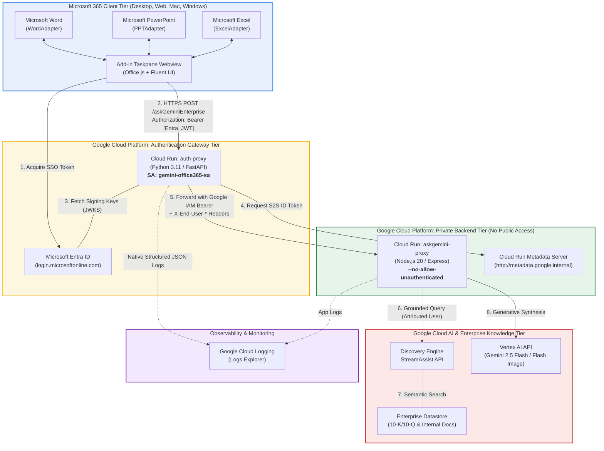
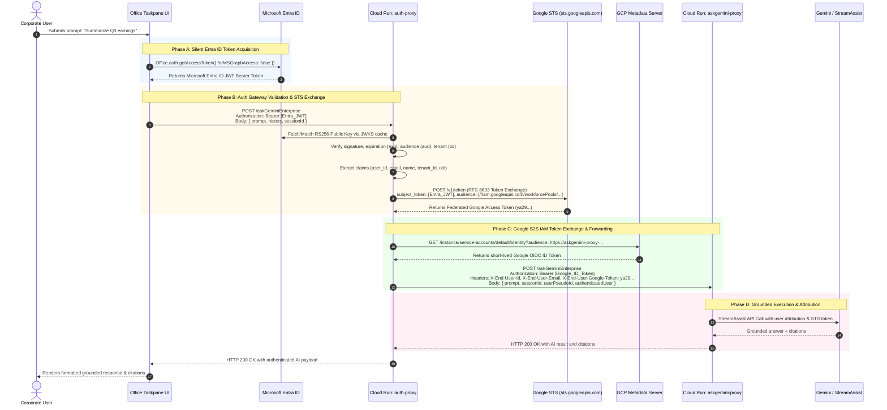
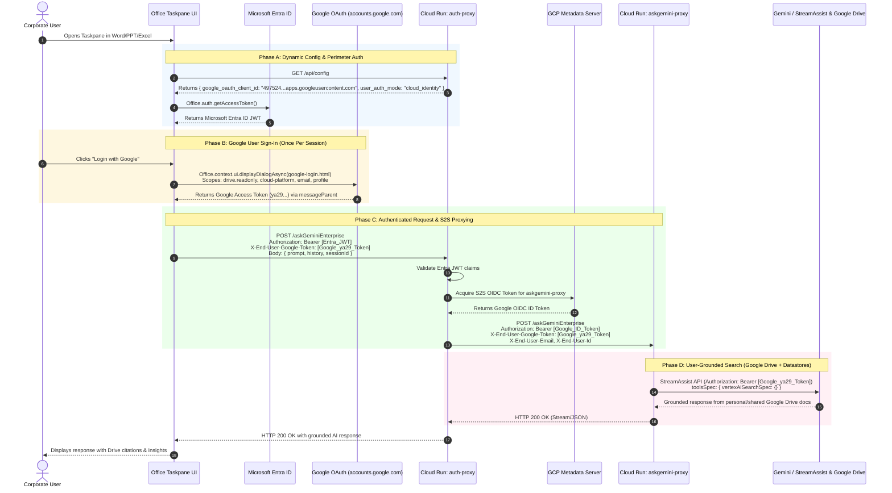

# Developer Architecture & System Evolution Guide: Gemini for Microsoft 365
**Author:** Carlos Augusto, Principal Architect, Google  
**License:** Apache-2.0  

> **Target Audience:** Backend & Frontend Developers, Cloud Architects, and DevOps Engineers  
> **Repository:** `retail-gemini-for-office-365`  
> **Master Deployment Runbook:** [`DEPLOYMENT_INSTRUCTIONS.md`](DEPLOYMENT_INSTRUCTIONS.md)  
> 
> | Identity Track | GCP Cloud Run Project | Discovery Engine Project & Location | Entra ID Client ID | Auth Mode |
> | :--- | :--- | :--- | :--- | :--- |
> | **Track 1: WIF (SSO)** | `agentspace-wif` (`1062675944253`) | `agentspace-wif` (`global`) | `85fb5428-6249-4131-9eeb-f2436d5d4d8c` | `auto` / `wif` |
> | **Track 2: Cloud Identity** | `agentspace-452714` (`16933400417`) | `jeansson-gem-ent-ci` (`us`) | `e871aa77-54f7-4310-a549-cad3b1edee4a` | `cloud_identity` |

---

## 📑 Table of Contents
1. [Executive Summary & Motivation](#1-executive-summary--motivation)
2. [Architecture Comparison: Original vs. New Decoupled Architecture](#2-architecture-comparison-original-vs-new-decoupled-architecture)
3. [End-to-End System Architecture & Flow Diagrams](#3-end-to-end-system-architecture--flow-diagrams)
4. [Deep Dive: Auth-Proxy Microservice (`authproxy/`)](#4-deep-dive-auth-proxy-microservice-authproxy)
5. [Service Account & IAM Security Posture](#5-service-account--iam-security-posture)
6. [Comprehensive Code Changes & File Inventory](#6-comprehensive-code-changes--file-inventory)
7. [Frontend SSO Integration Architecture (`microsoft-addin/`)](#7-frontend-sso-integration-architecture-microsoft-addin)
8. [Manifest Architecture, Sideloading & Enterprise Rollout](#8-manifest-architecture-sideloading--enterprise-rollout)
9. [Developer Runbook, Logging & Troubleshooting](#9-developer-runbook-logging--troubleshooting)

---

## 1. Executive Summary & Motivation

### The Problem with the Original Design
In the initial implementation of the Gemini for Microsoft 365 platform:
- The backend Cloud Run / Cloud Function service (`askgemini-proxy` / `geminiproxy`) was deployed with `--allow-unauthenticated`, leaving the core AI inference and enterprise grounding engine completely open on the public internet.
- Anyone with the service URL could invoke Gemini 2.5 Flash and StreamAssist Discovery Engine without verifying if they were an authenticated corporate employee.
- End-user identity in the client was simulated using arbitrary client-generated identifiers (`office_user_xyz` stored in browser `localStorage`), making audit trails and per-user grounding policies impossible to enforce reliably.
- Tight coupling between authentication, token parsing, and generative AI execution would have required replicating complex Microsoft Entra ID JWT verification across every existing and future backend microservice.

### The New Decoupled Architecture
To solve this, we implemented an **Enterprise Decoupled Authentication Gateway** model (Milestone 1):
1. **Isolated Auth Gateway (`auth-proxy`)**: A dedicated, ultra-fast Python FastAPI microservice that acts as the sole public-facing gatekeeper. It validates Microsoft Entra ID (Azure AD) Single Sign-On JWT Bearer tokens against Microsoft's public JWKS keys.
2. **Locked-Down Private Backend (`askgemini-proxy`)**: The generative AI and StreamAssist backend is stripped of public ingress (`--no-allow-unauthenticated`). It can only be invoked by Google Cloud Service Accounts presenting valid Google Cloud OpenID Connect (OIDC) identity tokens.
3. **Dedicated Service Account (`gemini-office365-sa`)**: `auth-proxy` runs under its own least-privilege service account. Upon authenticating an end user, it fetches a short-lived Google S2S IAM token and proxies the request to `askgemini-proxy`.
4. **Verified End-User Context Propagation**: `auth-proxy` extracts authenticated corporate claims (`email`, `user_id`, `name`, `tenant_id`, `oid`) and forwards them via HTTP headers (`X-End-User-*`) to `geminiproxy`, which attaches them to Discovery Engine StreamAssist sessions.
5. **Native GCP Structured JSON Logging**: All requests, claims, and latencies are formatted as structured JSON natively indexed by Google Cloud Logging, featuring a configurable `VERBOSE_LOGGING=true` diagnostic mode.

### The Dual Authentication Boundary Model

A common architectural question is: *“If using Google Workspace (GSuite) where users log in with Google, why is Microsoft Entra ID still configured?”*

The architecture enforces **two distinct, decoupled security perimeters**:

```
┌────────────────────────────────────────────────────────────────────────────────────────┐
│ 1. Microsoft 365 Client Tier (Office App & Webview)                                    │
│    👤 User: AlexW@5m4qby.onmicrosoft.com                                              │
│    🔑 Auth Mechanism: Microsoft Entra ID SSO (Office.auth.getAccessToken)              │
└───────────────────────────────────────────┬────────────────────────────────────────────┘
                                            │ (Passes Microsoft Bearer Token)
                                            ▼
┌────────────────────────────────────────────────────────────────────────────────────────┐
│ 2. GCP Ingestion & API Gateway Tier (`auth-proxy` on Cloud Run)                        │
│    🛡️ Gateway Defense: "Is this request coming from an authorized employee in our M365  │
│                       tenant using our approved Office Add-in?"                       │
└───────────────────────────────────────────┬────────────────────────────────────────────┘
                                            │ (Passes Google User OAuth Token ya29...)
                                            ▼
┌────────────────────────────────────────────────────────────────────────────────────────┐
│ 3. Google Gemini Enterprise Tier (Discovery Engine / Google Drive)                     │
│    👤 User: caugusto@google.com                                                        │
│    🔑 Auth Mechanism: Google 3-Legged OAuth                                            │
│    🎯 Purpose: "Which Google Drive files and Cloud Identity permissions does user have?"│
└────────────────────────────────────────────────────────────────────────────────────────┘
```

1. **Perimeter 1: API Gateway Ingestion Protection (Entra ID)**:
   - Validates that the request originates from an authentic corporate employee inside the licensed Microsoft 365 tenant (`MICROSOFT_ENTRA_TENANT_ID`) using the authorized Office Add-in (`MICROSOFT_ENTRA_APP_ID`).
   - Prevents unauthorized external traffic from invoking the Cloud Run endpoints or consuming Vertex AI/Discovery Engine quota.
   - Enables seamless silent single sign-on inside Office via `<WebApplicationInfo>`.
2. **Perimeter 2: Data Grounding & ACL Authorization (Google Cloud Identity / GSuite)**:
   - Evaluates what corporate Google Drive documents, Google Workspace resources, or Enterprise Datastores the user is permitted to search.
   - Ensures zero-trust data access control: responses are grounded only on documents the user has personal permission to read.

---

## 2. Architecture Comparison: Original vs. New Decoupled Architecture

| Dimension | Original Architecture (v1.0) | New Decoupled Architecture (v2.0) |
| :--- | :--- | :--- |
| **Backend Ingress Security** | Publicly accessible (`--allow-unauthenticated`). No token validation. | Private Cloud Run (`--no-allow-unauthenticated`). Only invokable by `gemini-office365-sa`. |
| **Authentication Perimeter** | None. Any caller on the internet could trigger Gemini API calls. | Microsoft Entra ID SSO JWT verification via RS256 JWKS public key cryptography. |
| **User Identity Source** | Random string in browser `localStorage` (`office_user_abc123`). | Cryptographically verified claims from corporate Microsoft 365 Entra ID token (`AlexW@contoso.com`). |
| **Microservice Decoupling** | Monolithic: Each backend service had to handle its own auth or remain open. | Decoupled: `auth-proxy` handles auth once for all present and future backend engines. |
| **Service-to-Service IAM** | None (direct unauthenticated HTTP calls). | Google Cloud IAM OIDC Service-to-Service (S2S) authentication using `roles/run.invoker`. |
| **Logging & Observability** | Raw `console.log` strings across services. | Native GCP Structured JSON logging with `httpRequest`, `severity`, and `structured_context`. |
| **Auditability & Grounding** | Anonymous sessions in Discovery Engine. | User-attributed sessions (`userPseudoId` = verified corporate UPN/email). |

---

## 3. End-to-End System Architecture & Flow Diagrams

### 3.1 High-Level Component Topology



---

### 3.2 Track 1: Workforce Identity Federation (WIF) Sequence Diagram

In Track 1, users experience zero Google login prompts. Their Microsoft Entra ID JWT is exchanged on the fly for a Google STS federated token.



---

### 3.3 Track 2: Cloud Identity / Google Workspace Sequence Diagram

In Track 2, Microsoft Entra ID secures the perimeter, and a 3-Legged Google User OAuth token authorizes access to personal and shared Google Drive files via Discovery Engine.



> [!NOTE]
> ### 💡 Understanding S2S (Service-to-Service) Authentication
> **S2S** stands for **Service-to-Service** authentication in Google Cloud.
> - **The Goal**: The generative AI and grounding backend (`askgemini-proxy`) is deployed as a private Cloud Run microservice (`--no-allow-unauthenticated`). It has **zero public access** on the internet.
> - **The Mechanism**: To invoke `askgemini-proxy`, the calling service (`auth-proxy`) must present a cryptographically signed **Google Cloud OIDC ID Token** in the `Authorization: Bearer <token>` header.
> - **The Role**: The token is minted by the local GCP metadata server on behalf of the `gemini-office365-sa` Service Account. Google Cloud's infrastructure automatically verifies that this service account holds the `roles/run.invoker` IAM role before letting the request reach `askgemini-proxy`.

---

## 4. Deep Dive: Auth-Proxy Microservice (`authproxy/`)

The `auth-proxy` is a standalone Python FastAPI application located in [`authproxy/main.py`](authproxy/main.py).

### 4.1 Key Modules & Responsibilities

#### 1. Microsoft JWKS Public Key Verification
```python
JWKS_URL = "https://login.microsoftonline.com/common/discovery/v2.0/keys"
jwks_client = jwt.PyJWKClient(JWKS_URL)
```
- Fetches Microsoft's rolling public RSA keys.
- Decodes the unverified JWT header to locate the `kid` (Key ID).
- Resolves the exact public key and cryptographically verifies the token signature using the `RS256` algorithm.

#### 2. Multi-Audience & Client ID Matching
Tokens issued by Microsoft Entra ID for Office Add-ins can contain either:
- The raw Application (client) ID GUID: `b990d644-e47b-4575-97b3-2067c488042b`
- The full Application ID URI: `api://gemini-frontend-16933400417.us-central1.run.app/b990d644-e47b-4575-97b3-2067c488042b`

`authproxy/main.py` dynamically validates all formats to prevent false-negative authentication rejections.

#### 3. User Identity Claim Normalization
```python
def extract_user_from_payload(payload: Dict[str, Any]) -> AuthenticatedUser:
    email = payload.get("email") or payload.get("preferred_username") or payload.get("upn")
    user_id = email or payload.get("sub") or payload.get("oid") or "anonymous_authenticated_user"
    name = payload.get("name") or payload.get("preferred_username") or user_id
    tenant_id = payload.get("tid")
    oid = payload.get("oid")
    sub = payload.get("sub")
    scopes = payload.get("scp", "").split() if payload.get("scp") else []
    roles = payload.get("roles", [])
    ...
```
This guarantees that regardless of whether the user logs in with a UPN, an email alias, or a subject claim, downstream services receive a standardized identity model.

#### 4. Google S2S IAM Token Exchange (`get_google_id_token`)

##### What is Service-to-Service (S2S) IAM Authentication?
In enterprise Google Cloud architectures, microservices that should not be callable by the public are deployed with `--no-allow-unauthenticated`. Google Cloud Run enforces this at its global ingress proxy: any HTTP request without a valid Google-signed OpenID Connect (OIDC) ID token is immediately terminated with `HTTP 403 Forbidden` before your container ever receives the request.

`auth-proxy` bridges the gap between external Microsoft 365 clients and private Google Cloud backends:
1. **End-User Ingress**: `auth-proxy` accepts requests from Office 365, verifying the incoming Microsoft Entra ID JWT.
2. **S2S Token Acquisition**: `auth-proxy` queries the local Cloud Run instance metadata server at `http://metadata.google.internal/computeMetadata/v1/instance/service-accounts/default/identity?audience={DOWNSTREAM_BACKEND_URL}`.
   - The metadata server mints a signed Google OIDC token asserting the identity of the running Service Account (`gemini-office365-sa`).
   - This metadata query executes over the local VM/container bus with **sub-millisecond latency** (no outbound network hop to Google OAuth endpoints).
3. **Dual-Identity Forwarding**:
   - `Authorization: Bearer <Google_S2S_ID_Token>`: Authenticates the caller service to Google Cloud IAM (`roles/run.invoker`).
   - `X-End-User-Email`, `X-End-User-Id`, `X-End-User-Name`: Passes the authenticated human employee's corporate identity to Discovery Engine for session history and grounding attribution.
   - `X-End-User-Google-Token`: Passes the federated WIF access token when operating in Workforce Identity Federation mode.

##### Python Implementation in `authproxy/main.py`:
```python
def get_google_id_token(audience: str) -> Optional[str]:
    # 1. Cloud Run / GCE Metadata Server (sub-millisecond latency, zero external hops)
    metadata_url = f"http://metadata.google.internal/computeMetadata/v1/instance/service-accounts/default/identity?audience={audience}"
    try:
        req = urllib.request.Request(metadata_url, headers={"Metadata-Flavor": "Google"})
        with urllib.request.urlopen(req, timeout=3) as resp:
            return resp.read().decode("utf-8").strip()
    except Exception:
        pass

    # 2. Local fallback using google-auth library (used during local development)
    try:
        from google.auth.transport.requests import Request as GoogleAuthRequest
        from google.oauth2 import id_token
        return id_token.fetch_id_token(GoogleAuthRequest(), audience)
    except Exception:
        return None
```

#### 5. Gemini Enterprise Dynamic Identity Provider Auto-Discovery (`aclConfig`)
To seamlessly support both **Google Identity / Cloud Identity** and **Workforce Identity Federation (WIF)** without hardcoding organization-level WIF parameters or assuming static project configurations, `auth-proxy` dynamically inspects the target Google Cloud project's Gemini Enterprise Access Control List configuration via Google Cloud Discovery Engine:

```http
GET https://{location}-discoveryengine.googleapis.com/v1/projects/{project_id}/locations/{location}/aclConfig
```

> [!NOTE]
> **Required IAM Role**: To perform this auto-discovery call, the `auth-proxy` runtime identity (`gemini-office365-sa`) requires the `roles/discoveryengine.viewer` IAM role on the target GCP project.

**Live Response Shapes:**
- **Google Cloud Identity / Google Workspace (`agentspace-452714`)**:
  ```json
  {
    "name": "projects/16933400417/locations/global/aclConfig",
    "idpConfig": {
      "idpType": "GSUITE"
    }
  }
  ```
- **Workforce Identity Federation (`agentspace-wif`)**:
  ```json
  {
    "name": "projects/1062675944253/locations/global/aclConfig",
    "idpConfig": {
      "idpType": "THIRD_PARTY",
      "externalIdpConfig": {
        "workforcePoolName": "locations/global/workforcePools/ca-entra-id-oidc-pool"
      }
    }
  }
  ```

#### 6. Google STS RFC 8693 Token Exchange for WIF (`exchange_entra_jwt_for_wif_token`)
When `aclConfig` returns `idpType: "THIRD_PARTY"`, `auth-proxy` automatically constructs the STS audience URI (`//iam.googleapis.com/{workforcePoolName}/providers/{WIF_PROVIDER_NAME}`) and exchanges the end-user's verified Microsoft Entra ID JWT with Google Secure Token Service (`https://sts.googleapis.com/v1/token`):

```python
def exchange_entra_jwt_for_wif_token(
    entra_jwt: str, 
    workforce_pool_name: str, 
    provider_name: str = "entra-id-oidc-pool-provider"
) -> Tuple[Optional[str], Dict[str, Any]]:
    audience = f"//iam.googleapis.com/{workforce_pool_name}/providers/{provider_name}"
    payload = {
        "grant_type": "urn:ietf:params:oauth:grant-type:token-exchange",
        "audience": audience,
        "scope": "https://www.googleapis.com/auth/cloud-platform",
        "requested_token_type": "urn:ietf:params:oauth:token-type:access_token",
        "subject_token": entra_jwt,
        "subject_token_type": "urn:ietf:params:oauth:token-type:jwt"
    }
    resp = requests.post("https://sts.googleapis.com/v1/token", data=payload, timeout=10)
    ...
```

#### 7. Native GCP Cloud Logging Formatter & Service Account Fallback
```python
class GCPStructuredJsonFormatter(logging.Formatter):
    def format(self, record: logging.LogRecord) -> str:
        log_payload = {
            "severity": GCP_SEVERITY_MAP.get(record.levelname, "INFO"),
            "message": record.getMessage(),
            "time": datetime.now(timezone.utc).isoformat(),
            "logger": record.name,
            "logging.googleapis.com/labels": {
                "service": "auth-proxy",
                "version": "1.0.0",
                "verbose_mode": str(VERBOSE_LOGGING).lower()
            },
            "structured_context": getattr(record, "structured_context", {})
        }
        return json.dumps(log_payload, default=str)
```

#### 8. Dynamic Frontend Configuration Delivery (`GET /api/config`)
To prevent hardcoding any GCP or Entra ID Client IDs into static frontend JavaScript bundles, `auth-proxy` serves a lightweight public configuration endpoint:

```python
@app.get("/api/config")
async def get_app_config():
    return {
        "google_oauth_client_id": GOOGLE_OAUTH_CLIENT_ID,
        "user_auth_mode": USER_AUTH_MODE,
        "gcp_project_id": GCP_PROJECT_ID,
        "gcp_location": GCP_LOCATION,
        "status": "ok"
    }
```
When the Office Add-in initializes in Word, PowerPoint, or Excel, `authService.js` calls `GET /api/config` to dynamically retrieve `GOOGLE_OAUTH_CLIENT_ID` before rendering UI buttons or initiating OAuth flows.

#### 9. Cloud Identity 3-Legged OAuth Pass-Through (`X-End-User-Google-Token`)
When Gemini Enterprise is configured with **Cloud Identity / Google Workspace Identity**, end-users authenticate interactively via `Office.context.ui.displayDialogAsync` against `accounts.google.com` requesting `https://www.googleapis.com/auth/drive.readonly` and `https://www.googleapis.com/auth/cloud-platform`.

1. **Taskpane Header Attachment**: The frontend attaches the returned Google OAuth access token as `X-End-User-Google-Token: ya29...`.
2. **Gateway Forwarding**: `auth-proxy` receives the token, validates the incoming Microsoft Entra ID JWT, and forwards `X-End-User-Google-Token` directly to `askgemini-proxy` while bypassing Domain-Wide Delegation checks.
3. **Downstream Execution**: `askgemini-proxy` calls Discovery Engine `streamAssist` presenting `Authorization: Bearer <ya29...>` and `toolsSpec: { vertexAiSearchSpec: {} }`, executing user-grounded search over Google Drive with strict ACL evaluation.


In `geminiproxy` (`askgemini-proxy`), if `X-End-User-Google-Token` is absent:
- If `ALLOW_SERVICE_ACCOUNT_FALLBACK=true`: Emits a structured `WARNING` (`[AUTH_FALLBACK] No end-user Google token provided for user '...'. ALLOW_SERVICE_ACCOUNT_FALLBACK is enabled. Falling back to Cloud Run Service Account ADC credentials.`) and continues using the Service Account.
- If `ALLOW_SERVICE_ACCOUNT_FALLBACK=false`: Emits an `ERROR` (`[AUTH_REJECTED] Request for user '...' rejected: End-user Google token is required to enforce Gemini Enterprise licensing`) and returns `HTTP 403 Forbidden`.

---

## 5. Service Account & IAM Security Posture

### 5.1 Service Account Provisioning
| Entity | Value |
| :--- | :--- |
| **Service Account Name** | `gemini-office365-sa` |
| **Service Account Email** | `gemini-office365-sa@agentspace-452714.iam.gserviceaccount.com` |
| **Description** | Dedicated runtime identity for `auth-proxy` to invoke downstream backend services |

### 5.2 IAM Roles Assigned
1. **`roles/logging.logWriter`** (Project-level on `agentspace-452714`):
   - Enables `auth-proxy` to emit structured logs directly into Google Cloud Logging.
2. **`roles/run.invoker`** (Service-level on Cloud Run `askgemini-proxy`):
   - Grants `gemini-office365-sa` explicit permission to invoke the private `askgemini-proxy` service.

### 5.3 Ingress & Perimeter Rules
- **`auth-proxy`**: Public ingress (`--allow-unauthenticated`) is enabled at the Cloud Run boundary because the client is an Office 365 webview in Microsoft Word/PowerPoint/Excel. Security enforcement is handled at the application layer by validating Microsoft Entra ID JWT tokens.
- **`askgemini-proxy`**: Locked down (`--no-allow-unauthenticated`). Any direct call from the public internet is rejected with `HTTP 403 Forbidden` by Google Cloud Frontend.

---

## 6. Comprehensive Code Changes & File Inventory

### 6.1 Summary of Changed & Created Files

```
retail-gemini-for-office-365/
├── authproxy/                                # [NEW MICROSERVICE]
│   ├── main.py                               # FastAPI auth gateway, token validator, S2S client
│   ├── requirements.txt                      # Python dependencies (fastapi, pyjwt, cryptography, google-auth, requests)
│   ├── Dockerfile                            # Python 3.11-slim container image specification
│   ├── test_authproxy.py                     # Unit & integration tests for authproxy
│   ├── .env.example                          # Environment configuration template
│   └── README.md                             # Microservice documentation & Swagger endpoints
├── geminiproxy/
│   └── index.js                              # [MODIFIED] Added X-End-User-* header extraction & user attribution
├── manifest-wif.xml                          # [CONFIG] Office 365 manifest for WIF with <WebApplicationInfo> SSO binding
├── manifest-gsuite.xml                       # [CONFIG] Office 365 manifest for GSuite / Cloud Identity
├── DEPLOYMENT_INSTRUCTIONS.md                # [DOC] Live GCP deployment runbook, endpoints & IAM state
└── DEVELOPER_ARCHITECTURE_GUIDE.md           # [DOC] This document
```

---

### 6.2 Detailed Code Modifications

#### 1. [`authproxy/main.py`](authproxy/main.py)
- **Lines 21–90**: Implemented `GCPStructuredJsonFormatter` for native Google Cloud JSON logging and `VERBOSE_LOGGING` filtering.
- **Lines 100–158**: Added Entra ID configuration loader and `extract_user_from_payload()` claim parser.
- **Lines 115–150**: Implemented `get_google_id_token()` to query the GCP metadata server for S2S OIDC tokens.
- **Lines 160–340**: Implemented `verify_entra_token()` FastAPI dependency with PyJWKClient key caching, RS256 signature verification, and multi-audience matching.
- **Lines 449–504**: Added `/health`, `/api/auth/me`, and `/api/auth/validate` endpoints.
- **Lines 506–613**: Implemented `/askGeminiEnterprise` forwarding logic: attaches Google IAM token and `X-End-User-*` headers, proxies request to `DOWNSTREAM_BACKEND_URL`, and returns grounded results with user context.

#### 2. [`geminiproxy/index.js`](geminiproxy/index.js)
- **Lines 580–588**: Updated `handleGeminiEnterpriseRequest` to read identity claims from `req.headers['x-end-user-id']` and `req.headers['x-end-user-email']` as well as `req.body.userPseudoId`.
- **Line 587**: Updated logging to output authenticated corporate user context:
  ```javascript
  console.log(`Processing Gemini Enterprise request (Mode: ${BACKEND_MODE})... Authenticated User: ${userPseudoId} (${endUserName || 'Corporate User'})`);
  ```
- **Line 473**: `callStreamAssistAPI` attaches the authenticated user identity to Discovery Engine session calls.

#### 3. [`authproxy/requirements.txt`](authproxy/requirements.txt)
- Added `google-auth>=2.29.0` and `httpx>=0.27.0` to support Google S2S OIDC token acquisition and resilient HTTP proxying.

#### 4. [`authproxy/test_authproxy.py`](authproxy/test_authproxy.py)
- Added unit tests for:
  - `/health` and `/` endpoint responses.
  - `extract_user_from_payload` claims parsing (verifying `email`, `name`, `roles`, `scopes`, and `tenant_id`).
  - `/askGeminiEnterprise` response structure in dev mode.

---

## 7. Frontend SSO Integration Architecture (`microsoft-addin/`)

The frontend Office 365 add-in (`microsoft-addin/`) integrates directly with Microsoft Office's native Single Sign-On (SSO) engine using `Office.auth.getAccessToken()`. It acquires an Entra ID access token for the signed-in corporate user, attaches it as a Bearer token in the `Authorization` header, and sends queries to the `auth-proxy` gateway.

### 7.1 Frontend Architecture & Key Components

```
microsoft-addin/
├── src/
│   ├── core/
│   │   ├── authService.js         # Silent Office.auth.getAccessToken() helper, token cache & JWT parser
│   │   └── geminiClient.js        # Dispatches queries to auth-proxy with Authorization: Bearer <token>
│   ├── taskpane/
│   │   ├── taskpane.js            # Orchestrates user interactions, host app context, and streaming response UI
│   │   └── taskpane.html          # Office Fluent UI taskpane interface and authenticated user badge
│   └── adapters/
│       └── HostAdapterFactory.js  # Dispatches document operations to WordAdapter, PPTAdapter, or ExcelAdapter
└── webpack.config.js              # Injects backend endpoint (AUTH_PROXY_URL) and builds production bundle
```

---

### 7.2 Frontend Code Implementation Reference

#### Component A: Token Acquisition & Caching (`microsoft-addin/src/core/authService.js`)
```javascript
/**
 * Authentication Service for Microsoft Office Add-in SSO
 */

let cachedToken = null;
let tokenExpiry = 0;

/**
 * Retrieves the Microsoft Entra ID JWT access token via Office.js SSO.
 * Falls back to interactive dialog if consent or interaction is required.
 */
export async function getOfficeAuthToken(forceRefresh = false) {
  const now = Date.now();
  if (!forceRefresh && cachedToken && now < tokenExpiry) {
    return cachedToken;
  }

  if (typeof Office === 'undefined' || !Office.auth || !Office.auth.getAccessToken) {
    console.warn('Office.auth.getAccessToken is not available in this environment. Running in unauthenticated dev mode.');
    return null;
  }

  try {
    const token = await Office.auth.getAccessToken({
      allowSignInPrompt: true,
      allowConsentPrompt: true,
      forMSGraphAccess: false
    });

    cachedToken = token;
    // Cache for 50 minutes (Entra ID tokens typically last 60 minutes)
    tokenExpiry = now + (50 * 60 * 1000);
    return token;
  } catch (error) {
    console.error('Office SSO token acquisition failed:', error);
    
    // Handle specific Office SSO error codes
    if (error.code === 13001 || error.code === 13002 || error.code === 13003) {
      console.warn('User not signed in or cancelled consent prompt.');
    } else if (error.code === 13007) {
      console.warn('Invalid Application ID URI or untrusted client.');
    }
    
    throw error;
  }
}
```

#### Step B: Update `microsoft-addin/src/core/geminiClient.js`
Update `getActiveProxyUrl()` and `askGeminiEnterprise()` to call `auth-proxy` with the Bearer token:

```javascript
import { getOfficeAuthToken } from './authService.js';

// Default endpoint points to auth-proxy
const DEFAULT_AUTH_PROXY_URL = 'https://auth-proxy-16933400417.us-central1.run.app/askGeminiEnterprise';

export function getActiveProxyUrl() {
  if (typeof window !== 'undefined' && window.localStorage) {
    const override = window.localStorage.getItem('gemini_proxy_url');
    if (override) return override;
  }
  return DEFAULT_AUTH_PROXY_URL;
}

export async function askGeminiEnterprise(prompt, history = [], sessionId = null, enableGrounding = true) {
  const functionUrl = getActiveProxyUrl();
  
  // 1. Acquire Entra ID SSO Token
  let authToken = null;
  try {
    authToken = await getOfficeAuthToken();
  } catch (authErr) {
    console.warn('Proceeding without SSO token (server may reject if REQUIRE_ENTRA_AUTH=true):', authErr);
  }

  const payload = { 
    prompt: prompt,
    history: history,
    enableGrounding: enableGrounding
  };
  if (sessionId) {
    payload.sessionId = sessionId;
  }

  const headers = {
    'Content-Type': 'application/json'
  };
  if (authToken) {
    headers['Authorization'] = `Bearer ${authToken}`;
  }

  console.log(`Sending authenticated request to auth-proxy: ${functionUrl}`);

  const response = await fetch(functionUrl, {
    method: 'POST',
    headers: headers,
    body: JSON.stringify(payload)
  });

  if (!response.ok) {
    const errorData = await response.json().catch(() => ({}));
    throw new Error(errorData.detail || errorData.error || `Server returned HTTP ${response.status}`);
  }

  return await response.json();
}
```

---

## 8. Manifest Architecture, Sideloading & Enterprise Rollout

The deployment lifecycle comprises manifest configuration, testing via sideloading across Office hosts, and tenant-wide distribution.

### 8.1 Manifest Configuration Check
Ensure [`manifest-wif.xml`](manifest-wif.xml) or [`manifest-gsuite.xml`](manifest-gsuite.xml) has the correct `<WebApplicationInfo>` block configured at the bottom:

For WIF (`manifest-wif.xml`):
```xml
  <WebApplicationInfo>
    <Id>85fb5428-6249-4131-9eeb-f2436d5d4d8c</Id>
    <Resource>api://gemini-frontend-1062675944253.us-central1.run.app/85fb5428-6249-4131-9eeb-f2436d5d4d8c</Resource>
    <Scopes>
      <Scope>access_as_user</Scope>
    </Scopes>
  </WebApplicationInfo>
```

### 8.2 Sideloading Validation Steps

#### 1. Office on the Web (PowerPoint / Word / Excel Online)
1. Open [Office 365](https://www.office.com/) and launch **PowerPoint Online** or **Word Online**.
2. Create a new blank presentation or document.
3. In the top ribbon, select **Insert** -> **Add-ins** -> **Upload My Add-in**.
4. Browse to and select [`manifest-wif.xml`](manifest-wif.xml) (or [`manifest-gsuite.xml`](manifest-gsuite.xml)).
5. Click **Upload**. The **Gemini Enterprise** icon will appear on the Home ribbon.
6. Click the icon to open the taskpane. Office will trigger SSO, and `auth-proxy` will authenticate the user.

#### 2. Office Desktop (macOS / Windows)
- **macOS**: Run `./scripts/sideload_mac.sh manifest-wif.xml` (or `manifest-gsuite.xml`) and restart the Office application.
- **Windows**: Use the Office Add-in Shared Folder Catalog or sideload via the Office 365 Developer Ribbon.

### 8.3 Enterprise Tenant-Wide Deployment
To deploy to all corporate users without manual sideloading:
1. Open the **[Microsoft 365 Admin Center](https://admin.microsoft.com/)**.
2. Navigate to **Settings** -> **Integrated apps**.
3. Click **Upload custom apps** -> Choose **Office Add-in** -> Provide URL or upload [`manifest-wif.xml`](manifest-wif.xml) / [`manifest-gsuite.xml`](manifest-gsuite.xml).
4. Assign to **Entire organization** or specific test groups.
5. Deployment will propagate to all corporate Office desktop and web apps within 6–24 hours.

---

## 9. Developer Runbook, Logging & Troubleshooting

### 9.1 Local Development & Testing

#### Running `auth-proxy` Locally
```bash
cd authproxy

# 1. Create virtual environment
python3 -m venv venv
source venv/bin/activate

# 2. Install dependencies
pip install -r requirements.txt

# 3. Configure local environment
export MICROSOFT_ENTRA_APP_ID="b990d644-e47b-4575-97b3-2067c488042b"
export REQUIRE_ENTRA_AUTH="false"    # Set to false to bypass auth locally
export VERBOSE_LOGGING="true"
export DOWNSTREAM_BACKEND_URL="https://askgemini-proxy-16933400417.us-central1.run.app"

# 4. Run unit tests
python3 -m unittest test_authproxy.py

# 5. Start development server
python3 main.py
```

---

### 9.2 Cloud Logging Queries (Log Explorer)

To inspect logs in Google Cloud Console:
👉 **[Open GCP Logs Explorer for `auth-proxy`](https://console.cloud.google.com/logs/query;query=resource.type%3D%22cloud_run_revision%22%0Aresource.labels.service_name%3D%22auth-proxy%22?project=agentspace-452714)**

#### Filter 1: View all requests and extracted end-user claims
```text
resource.type="cloud_run_revision"
resource.labels.service_name="auth-proxy"
jsonPayload.message=~"Processing add-in request|VERBOSE PAYLOAD"
```

#### Filter 2: View authentication errors & rejections
```text
resource.type="cloud_run_revision"
resource.labels.service_name="auth-proxy"
severity >= WARNING
```

#### Filter 3: Inspect downstream S2S invocation latency
```text
resource.type="cloud_run_revision"
resource.labels.service_name="auth-proxy"
jsonPayload.structured_context.httpRequest.latency:*
```

---

### 9.3 Common Error Codes & Resolutions

| HTTP Status | Error / Code | Root Cause | Resolution |
| :---: | :--- | :--- | :--- |
| `401` | `AUTH_HEADER_MISSING` | Request sent without `Authorization: Bearer <token>` header. | Ensure client calls `Office.auth.getAccessToken()` before making requests. |
| `401` | `AUTH_EXPIRED` | JWT `exp` timestamp is in the past. | Force token refresh in `authService.js` (`getOfficeAuthToken(true)`). |
| `401` | `AUTH_INVALID_AUDIENCE` | Token `aud` claim does not match `ENTRA_APP_ID` or Application ID URI. | Verify manifest `<Resource>` matches the exact Application ID URI configured in Entra ID. |
| `401` | `AUTH_KEY_NOT_FOUND` | Token `kid` header not found in Microsoft JWKS endpoint. | Token may have been issued by a different tenant authority or is malformed. |
| `403` | `Forbidden (Google IAM)` | `auth-proxy` failed to invoke `askgemini-proxy`. | Verify `gemini-office365-sa` has `roles/run.invoker` on `askgemini-proxy`. |
| `502` | `DOWNSTREAM_COMMUNICATION_ERROR` | `askgemini-proxy` timed out or unreachable. | Verify `DOWNSTREAM_BACKEND_URL` environment variable and Cloud Run status. |

---

---

## 10. Developer Team Guide: Getting Your Code to This Version

For engineering teams upgrading their existing add-in or backend codebase to this architecture, follow this step-by-step checklist across the three tiers:

### 10.1 Tier 1: Frontend Add-in (`microsoft-addin`)

1. **Add `src/core/authService.js`**:
   Implements `Office.auth.getAccessToken({ forMSGraphAccess: false, allowSignInPrompt: true })` with token caching (50 min TTL), profile claim decoding (`upn`, `email`, `name`, `tid`), and graceful error propagation for Office error codes (13001, 13007).

2. **Update `src/core/geminiClient.js`**:
   Ensure all network requests to `auth-proxy` pass the Entra ID token in the `Authorization` header:
   ```javascript
   const token = await getOfficeAuthToken();
   const headers = { 'Content-Type': 'application/json' };
   if (token) {
     headers['Authorization'] = `Bearer ${token}`;
   }
   const response = await fetch(`${AUTH_PROXY_URL}/askGeminiEnterprise`, {
     method: 'POST',
     headers,
     body: JSON.stringify(payload)
   });
   ```

3. **Configure Manifest (`manifest-wif.xml` or `manifest-gsuite.xml`)**:
   - Ensure `<SourceLocation>` points to your frontend hosting domain (e.g., `https://gemini-frontend-1062675944253.us-central1.run.app/taskpane.html`).
   - Configure `<WebApplicationInfo>` with the exact Application ID URI:
     ```xml
     <WebApplicationInfo>
       <Id>85fb5428-6249-4131-9eeb-f2436d5d4d8c</Id>
       <Resource>api://gemini-frontend-1062675944253.us-central1.run.app/85fb5428-6249-4131-9eeb-f2436d5d4d8c</Resource>
       <Scopes>
         <Scope>access_as_user</Scope>
       </Scopes>
     </WebApplicationInfo>
     ```
   - **Critical**: Use only ONE `<Scope>access_as_user</Scope>`. Multiple scopes will cause Office 365 manifest validation failure.

### 10.2 Tier 2: Authentication Gateway (`authproxy`)

1. **Deploy Python 3.11 FastAPI `auth-proxy`**:
   - Validates Microsoft Entra ID JWTs using public Microsoft JWKS (`https://login.microsoftonline.com/common/discovery/v2.0/keys`).
   - Supports multi-audience matching (matches raw Client ID or full `api://...` URI).
   - Dynamically calls `GET /v1/.../aclConfig` to inspect Identity Provider configuration (`GSUITE` vs `THIRD_PARTY`).
   - Fetches Google Cloud OIDC ID tokens via instance metadata server to invoke downstream private Cloud Run services.
   - Forwards normalized user claims: `X-End-User-Email`, `X-End-User-ID`, `X-End-User-Tenant-ID`, and `X-End-User-Auth-Mode`.

2. **IAM Configuration for `gemini-office365-sa`**:
   ```bash
   # Logging
   gcloud projects add-iam-policy-binding PROJECT_ID \
     --member="serviceAccount:gemini-office365-sa@PROJECT_ID.iam.gserviceaccount.com" \
     --role="roles/logging.logWriter"

   # Gemini Enterprise Discovery Engine IdP aclConfig
   gcloud projects add-iam-policy-binding PROJECT_ID \
     --member="serviceAccount:gemini-office365-sa@PROJECT_ID.iam.gserviceaccount.com" \
     --role="roles/discoveryengine.viewer"

   # Downstream Cloud Run Invocation
   gcloud run services add-iam-policy-binding askgemini-proxy \
     --region=us-central1 \
     --member="serviceAccount:gemini-office365-sa@PROJECT_ID.iam.gserviceaccount.com" \
     --role="roles/run.invoker"
   ```

### 10.3 Tier 3: Core Inference Backend (`geminiproxy`)

1. **Enforce Private S2S Traffic**:
   ```bash
   gcloud run services update askgemini-proxy \
     --region=us-central1 \
     --no-allow-unauthenticated
   ```

2. **Ingest User Attribution in `geminiproxy/index.js`**:
   ```javascript
   const endUserEmail = req.headers['x-end-user-email'] || 'anonymous_dev_user';
   const endUserId = req.headers['x-end-user-id'] || endUserEmail;
   const endUserTenant = req.headers['x-end-user-tenant-id'] || 'default_tenant';
   ```

3. **Pass User Context to Discovery Engine `streamAssist`**:
   Include `userMetadata` and `endUserEmail` in Discovery Engine queries so enterprise access controls and session attribution are respected.

---

## 11. Production Validation & Handoff Summary

- [x] **Milestone 1 Complete**: `auth-proxy` created, tested, and deployed with dedicated service account `gemini-office365-sa`.
- [x] **Downstream Hardening Complete**: `askgemini-proxy` locked down with `--no-allow-unauthenticated` and bound to `gemini-office365-sa`.
- [x] **End-User Attribution Complete**: `geminiproxy` extracts `X-End-User-*` headers and tags StreamAssist sessions.
- [x] **Milestone 2 Complete**: Office.js SSO token acquisition (`Office.auth.getAccessToken()`), Domain Matching resolution, and UI identity indicator verified.
- [x] **Milestone 3 Complete**: Centralized Microsoft 365 Admin Center deployment guide documented in [`MICROSOFT_365_ADMIN_CENTER_DEPLOYMENT.md`](MICROSOFT_365_ADMIN_CENTER_DEPLOYMENT.md).

