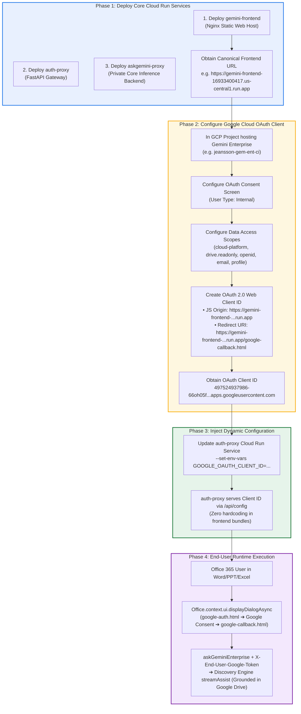

# Google OAuth 2.0 Web Client Setup & Deployment Ordering Guide
**Author:** Carlos Augusto, Principal Architect, Google  
**License:** Apache-2.0  

**Target Environment:** Gemini Enterprise configured with **Cloud Identity / Google Workspace**  
**Integration:** Microsoft Office 365 Add-in (Word, PowerPoint, Excel)  
**Authentication Strategy:** 3-Legged User OAuth with End-User Consent (No Domain-Wide Delegation required)

---

## 📑 Executive Summary

When a Google Cloud Gemini Enterprise (Discovery Engine) application is configured with **Cloud Identity / Google Workspace Identity** (`idpType: GSUITE`), user-level document search (such as searching personal/shared Google Drive files via `toolsSpec: { vertexAiSearchSpec: {} }`) requires an authorized Google user credential.

To avoid requiring domain-wide super-administrator privileges (Domain-Wide Delegation / DWD), this solution implements **3-Legged Google User OAuth**. Each user signs into Google directly from within the Microsoft Office 365 taskpane, authorizing read access to their Drive files.



---

## ⚠️ Critical Dependency & Deployment Ordering

Creating the Google OAuth 2.0 Web Client **strictly depends on having the live `gemini-frontend` URL**:
- Google's OAuth 2.0 security policies require exact URI matching for **Authorized JavaScript Origins** and **Authorized Redirect URIs**.
- Wildcards are prohibited in redirect URIs.
- Therefore, **you must deploy `gemini-frontend` and backend proxies first** before creating the OAuth Client in the Google Cloud Console.

---

## Step-by-Step Setup Instructions

### Phase 1: Deploy Backend & Frontend Infrastructure

Deploy all three Cloud Run services to obtain your environment endpoints:

1. **Deploy Backend Proxy (`geminiproxy` / `askgemini-proxy`)**:
   ```bash
   gcloud run deploy askgemini-proxy \
     --source ./geminiproxy \
     --project <PROJECT_ID> \
     --region <REGION> \
     --no-allow-unauthenticated
   ```
2. **Deploy Auth Gateway Proxy (`authproxy` / `auth-proxy`)**:
   ```bash
   gcloud run deploy auth-proxy \
     --source ./authproxy \
     --project <PROJECT_ID> \
     --region <REGION> \
     --allow-unauthenticated
   ```
3. **Deploy Frontend Add-in Host (`microsoft-addin` / `gemini-frontend`)**:
   ```bash
   gcloud run deploy gemini-frontend \
     --source ./microsoft-addin \
     --project <PROJECT_ID> \
     --region <REGION> \
     --allow-unauthenticated
   ```
4. **Note the Live Frontend URL**:
   * Example: `https://gemini-frontend-16933400417.us-central1.run.app`

---

### Phase 2: Configure Google Cloud OAuth Client in Gemini Enterprise Project

Navigate to the Google Cloud Project hosting your Gemini Enterprise / Discovery Engine instance (e.g., `jeansson-gem-ent-ci`).

#### 1. Configure OAuth Consent Screen & Audience
1. In Google Cloud Console, navigate to **APIs & Services** ➔ **OAuth consent screen**  
   *(Direct URL: `https://console.cloud.google.com/apis/credentials/consent`)*
2. Select **User Type:** **Internal** *(Allows all users within your Google Workspace / Cloud Identity domain to sign in immediately without unverified app warnings)*.
3. Click **Create**.
4. **App Information:**
   * **App name:** `Gemini Enterprise for Office 365`
   * **User support email:** Select your administrator email.
   * **Developer contact information:** Enter your administrator email.
5. Click **Save and Continue**.

#### 2. Configure Data Access (Scopes)
1. Under **Data Access / Scopes** (or **APIs & Services** ➔ **OAuth consent screen** ➔ **Data Access**):
2. Click **Add or Remove Scopes**.
3. Select standard identity scopes:
   * `.../auth/userinfo.email`
   * `.../auth/userinfo.profile`
   * `openid`
4. In the **Manually add scopes** box at the bottom, paste:
   ```text
   https://www.googleapis.com/auth/cloud-platform,https://www.googleapis.com/auth/drive.readonly
   ```
5. Click **Add to Table**.
6. Click **Update**, then click **Save and Continue** (or **Save**).

#### 3. Create OAuth 2.0 Web Client ID
1. In the left navigation menu, go to **Credentials**  
   *(Direct URL: `https://console.cloud.google.com/apis/credentials`)*
2. Click **+ CREATE CREDENTIALS** at the top ➔ Select **OAuth client ID**.
3. Fill in the required fields:
   * **Application type:** Select **Web application**.
   * **Name:** `Gemini Office 365 Web Client`
   * **Authorized JavaScript origins:**  
     Click **+ ADD URI** and enter your deployed frontend URL:
     ```text
     https://gemini-frontend-16933400417.us-central1.run.app
     ```
   * **Authorized redirect URIs:**  
     Click **+ ADD URI** and enter the dedicated callback page:
     ```text
     https://gemini-frontend-16933400417.us-central1.run.app/google-callback.html
     ```
4. Click **CREATE**.
5. Copy the generated **Client ID** (e.g. `497524937986-66oh05fskrkufpv2he7fb00fmpd4nlt9.apps.googleusercontent.com`).

---

### Phase 3: Set Environment Variable on `auth-proxy`

To adhere to enterprise security best practices, the Client ID is **never hardcoded** in client-side code. Instead, `auth-proxy` dynamically delivers it to the add-in via `/api/config`.

Update your `auth-proxy` service on Cloud Run:

```bash
gcloud run services update auth-proxy \
  --project <PROJECT_ID> \
  --region <REGION> \
  --update-env-vars GOOGLE_OAUTH_CLIENT_ID="<YOUR_GOOGLE_OAUTH_CLIENT_ID>"
```

#### Verify Dynamic Configuration Endpoint:
```bash
curl -s https://auth-proxy-16933400417.us-central1.run.app/api/config
```
Expected Output:
```json
{
  "google_oauth_client_id": "497524937986-66oh05fskrkufpv2he7fb00fmpd4nlt9.apps.googleusercontent.com",
  "microsoft_entra_app_id": "e871aa77-54f7-4310-a549-cad3b1edee4a,...",
  "user_auth_mode": "cloud_identity",
  "gcp_project_id": "jeansson-gem-ent-ci",
  "require_entra_auth": true
}
```

---

### Phase 4: Runtime Flow in Office 365 Add-in

```mermaid
sequenceDiagram
    autonumber
    actor User as Enterprise User (scim@...)
    participant Addin as Office Add-in Taskpane
    participant AuthProxy as auth-proxy (/api/config)
    participant Dialog as Office Dialog API (google-auth.html)
    participant GoogleAuth as accounts.google.com
    participant Callback as google-callback.html
    participant GeminiProxy as askgemini-proxy
    participant DiscEng as Discovery Engine (streamAssist)

    Addin->>AuthProxy: GET /api/config
    AuthProxy-->>Addin: Returns { google_oauth_client_id: "497524..." }
    
    User->>Addin: Clicks "📁 Connect Drive"
    Addin->>Dialog: Office.context.ui.displayDialogAsync(google-auth.html?client_id=...&login_hint=user@...)
    Dialog->>GoogleAuth: Redirects to Google OAuth 2.0 Consent
    GoogleAuth->>User: Displays Data Access Consent (Drive Read-Only)
    User->>GoogleAuth: Approves Consent
    GoogleAuth->>Callback: Redirects to /google-callback.html#access_token=ya29...&expires_in=3599
    Callback->>Addin: Office.context.ui.messageParent({ google_token: "ya29..." })
    Callback->>Callback: Closes dialog window
    Addin->>Addin: Caches token; UI updates to "✅ Drive Linked"

    User->>Addin: Submits query: "Do you see documents referring api://...?"
    Addin->>AuthProxy: POST /askGeminiEnterprise (Headers: Authorization: Bearer <Entra_JWT>, X-End-User-Google-Token: ya29...)
    AuthProxy->>GeminiProxy: Forwards request with Google S2S IAM token + X-End-User-Google-Token
    GeminiProxy->>DiscEng: POST :streamAssist (Headers: Authorization: Bearer <ya29...>, toolsSpec: { vertexAiSearchSpec: {} })
    DiscEng->>DiscEng: Searches user's Google Drive files
    DiscEng-->>GeminiProxy: Streams grounded SSE chunks
    GeminiProxy-->>AuthProxy: Streams SSE response
    AuthProxy-->>Addin: Streams SSE response
    Addin-->>User: Renders grounded answer in Word / PowerPoint / Excel
```

---

## 🔒 Scope & Data Access Reference Table

| Scope URL | Scope Type | Purpose in Office 365 Integration |
| :--- | :--- | :--- |
| `openid` | OpenID Connect | Authenticates the user's Google profile |
| `https://www.googleapis.com/auth/userinfo.email` | Identity | Captures the primary user email (`scim@...`) |
| `https://www.googleapis.com/auth/userinfo.profile` | Identity | Captures the user's display name |
| `https://www.googleapis.com/auth/cloud-platform` | Core GCP | Authorizes Discovery Engine `streamAssist` API calls |
| `https://www.googleapis.com/auth/drive.readonly` | Google Drive | Read-only search & RAG grounding on personal Drive files |

---

## ⚖️ Identity Mode Comparison: Cloud Identity vs Workforce Identity Federation

| Parameter | Cloud Identity Mode (This Guide) | Workforce Identity Federation (WIF) |
| :--- | :--- | :--- |
| **GCP Project IDP Type** | `GSUITE` (Google Cloud Identity / Workspace) | `THIRD_PARTY` (External OIDC / SAML) |
| **Primary User Directory** | Google Workspace or Cloud Identity | Microsoft Entra ID (Azure AD), Okta, Ping |
| **Token Resolution** | 3-Legged Google User OAuth (via popup dialog) | Dynamic STS Token Exchange (`sts.googleapis.com`) |
| **User Consent Required** | Yes (1-click interactive prompt per user) | No (Admin-configured Workforce Pool trust) |
| **Drive File Grounding** | Supported (via `drive.readonly` scope) | Depends on Workspace connector mapping |
| **OAuth Client Required** | **Yes** (in GCP Project hosting Gemini Enterprise) | No (Uses Entra ID App Registration & WIF Provider) |

---
*Created for Gemini Enterprise Microsoft Office 365 Architecture*
