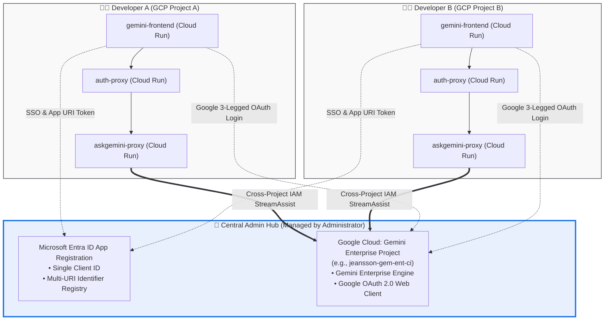

# Multi-Developer Onboarding & Central Admin Guide

**Author:** Carlos Augusto, Principal Architect, Google  
**Architecture:** Shared Central Entra ID & Gemini Enterprise Hub with Distributed Developer Spokes  

---

## 🧭 Overview & Topology

In enterprise sandbox or multi-developer scenarios, multiple developers deploy and test their own independent microservice instances (`gemini-frontend`, `auth-proxy`, `askgemini-proxy`) within their personal Google Cloud projects.

Rather than creating separate Microsoft Entra ID tenants or separate Gemini Enterprise instances for every developer, a **Central Administrator** manages a shared hub:



---

## 📋 1. Developer Intake Form (What the Admin Needs from Developer)

Before onboarding, the developer must provide the Central Administrator with the following 4 parameters:

| Parameter | Description | Required / Optional | Example |
| :--- | :--- | :---: | :--- |
| **`DEV_PROJECT_ID`** | Developer's personal GCP Project ID | **Required** | `developer-alex-sandbox` |
| **`DEV_PROJECT_NUM`** | Developer's GCP Project Number | **Required** | `987654321012` |
| **`DEV_SERVICE_ACCOUNT`** | Developer's Cloud Run Service Account Email | **Derived** | `gemini-office365-sa@<DEV_PROJECT_ID>.iam.gserviceaccount.com` |
| **`DEV_FRONTEND_URL`** | Live HTTPS URL of developer's `gemini-frontend` | **Derived** | `https://gemini-frontend-<DEV_PROJECT_NUM>.us-central1.run.app` |
| **`DEV_USER_EMAIL`** | Developer's test email (Only needed if NOT using a Google Group) | *Optional* | `alex@yourdomain.com` |

---

## 🛠️ 2. Central Administrator Step-by-Step Execution Runbook

The Central Administrator executes the following 3 steps to authorize the new developer environment:

### Step 1: Microsoft Entra ID — Append Developer Application ID URI

Microsoft Office requires that the `<Resource>` in the Add-in manifest matches an authorized Application ID URI on the Entra App Registration.

Set your variables in your terminal:
```bash
# Central Administrator Configuration
ENTRA_APP_ID="YOUR_CENTRAL_ENTRA_APP_ID" # e.g. e871aa77-54f7-4310-a549-cad3b1edee4a

# New Developer Details
DEV_FRONTEND_URL="https://gemini-frontend-987654321012.us-central1.run.app"
NEW_URI="api://${DEV_FRONTEND_URL#https://}/${ENTRA_APP_ID}"
```

#### Option A: Automated via Azure CLI (Recommended)
Fetch the existing list of URIs and append the developer's new URI:
```bash
# 1. Fetch current registered identifier URIs
CURRENT_URIS=$(az ad app show --id "${ENTRA_APP_ID}" --query "identifierUris" -o tsv)

# 2. Append the new developer URI and update Entra ID
az ad app update --id "${ENTRA_APP_ID}" \
  --identifier-uris ${CURRENT_URIS} "${NEW_URI}"
```

#### Option B: Via Azure Portal UI
1. Navigate to **Microsoft Entra ID** ➔ **App registrations** ➔ Select your central app.
2. Click **Expose an API**.
3. Under **Application ID URI**, click **Add** (or edit the URI list) and append:
   `api://gemini-frontend-<DEV_PROJECT_NUM>.us-central1.run.app/<ENTRA_APP_ID>`
4. Click **Save**.

---

### Step 2: Google Cloud IAM — Authorize Developer Service Account on Central GE Project

Grant cross-project permissions so the developer's `askgemini-proxy` service account can execute Discovery Engine queries on the central Gemini Enterprise project:

```bash
# Central Gemini Enterprise Project ID
CENTRAL_GE_PROJECT="jeansson-gem-ent-ci"

# Developer's Service Account
DEV_SA="gemini-office365-sa@developer-alex-sandbox.iam.gserviceaccount.com"

# 1. Grant Discovery Engine Editor (enables streamAssist execution)
gcloud projects add-iam-policy-binding "${CENTRAL_GE_PROJECT}" \
  --member="serviceAccount:${DEV_SA}" \
  --role="roles/discoveryengine.editor"

# 2. Grant Service Usage Consumer (enables API invocation across project boundaries)
gcloud projects add-iam-policy-binding "${CENTRAL_GE_PROJECT}" \
  --member="serviceAccount:${DEV_SA}" \
  --role="roles/serviceusage.serviceUsageConsumer"

# 3. Grant Developer User identity Discovery Engine Viewer (for Track 2 GSuite Drive search)
DEV_USER="alex@yourdomain.com"
gcloud projects add-iam-policy-binding "${CENTRAL_GE_PROJECT}" \
  --member="user:${DEV_USER}" \
  --role="roles/discoveryengine.viewer"
```

---

### Step 3: Google Cloud OAuth 2.0 Client — Whitelist Developer Frontend URIs (Track 2)

To prevent `Error 400: redirect_uri_mismatch` when the developer clicks **"Login with Google"** inside the Office taskpane:

1. In the Google Cloud Console, switch to the project hosting your OAuth Client (e.g. `jeansson-gem-ent-ci`).
2. Navigate to **APIs & Services** ➔ **Credentials**  
   *(Direct link: `https://console.cloud.google.com/apis/credentials`)*
3. Click on the **OAuth 2.0 Client ID** used by the Add-in (e.g., `Gemini Office 365 Web Client`).
4. **Authorized JavaScript origins:**  
   Click **+ ADD URI** and paste the developer's live `gemini-frontend` URL:
   ```text
   https://gemini-frontend-987654321012.us-central1.run.app
   ```
5. **Authorized redirect URIs:**  
   Click **+ ADD URI** and paste the callback URL:
   ```text
   https://gemini-frontend-987654321012.us-central1.run.app/google-callback.html
   ```
6. Click **Save**.
