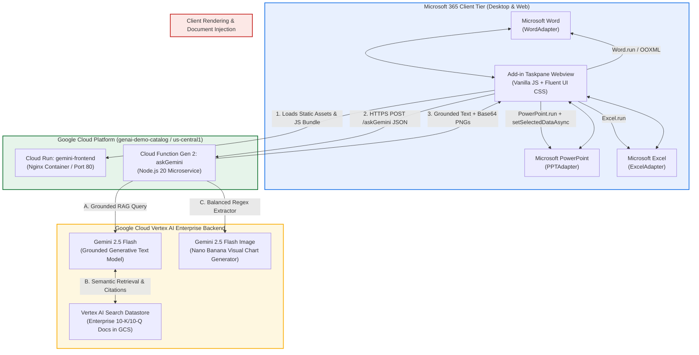

# Gemini for Microsoft Office 365 (Word, PowerPoint, Excel)
**Author:** Sathya AG, Principal Architect, Google  
**License:** Apache-2.0  

An enterprise-ready Microsoft 365 Add-in and Google Cloud backend that integrates **Google Cloud Vertex AI (Gemini 2.5 Flash, Vertex AI Search Grounding, and Gemini 2.5 Flash Image / Nano Banana)** directly into **Microsoft Word**, **PowerPoint**, and **Excel**.

---

## 🌟 Key Capabilities

- **🏢 Enterprise Grounding & Zero Hallucination:** Directly grounded via **Vertex AI Search Datastores** over enterprise quarterly reports, policies, 10-K/10-Q SEC filings, and research documents in Google Cloud Storage.
- **🎨 Multimodal Visual Generation:** Generates high-resolution flat 2D vector charts and infographics via `gemini-2.5-flash-image` and natively embeds them into presentations and documents.
- **📄 Microsoft Word (`WordAdapter`):** Document summarization, risk analysis, text rewriting, and in-document `@gemini <prompt>` execution.
- **📊 Microsoft PowerPoint (`PPTAdapter`):** Automatic multi-slide executive deck generator with widescreen layouts, data tables, and native macOS WKWebView dual-pipeline visual injection.
- **📈 Microsoft Excel (`ExcelAdapter`):** Worksheet intelligence, cell range risk analysis, formula anomaly detection, and KPI metric cards.

---

## 🏗️ Architecture Overview



> 📖 For full architectural deep dives, sequence diagrams, and macOS WKWebView rendering pipelines, see [ARCHITECTURE.md](ARCHITECTURE.md).

---

## 📂 Repository Structure

```
gemini-for-office-365/
│
├── README.md                          # Main project overview & quick-start guide
├── ARCHITECTURE.md                    # Detailed architecture, grounding & visual flow diagrams
├── LICENSE                            # Apache-2.0 License
├── .gitignore                         # Root gitignore
│
├── microsoft-addin/                   # Microsoft Office 365 Add-in (Word, PowerPoint, Excel)
│   ├── manifest.xml                   # Office Add-in XML Manifest
│   ├── package.json                   # Webpack, Babel & Office.js dependencies
│   ├── webpack.config.js              # Webpack bundling configuration
│   ├── babel.config.json              # Babel presets
│   ├── Dockerfile                     # Nginx container for Cloud Run deployment
│   ├── nginx.conf                     # Nginx server configuration with CORS headers
│   ├── .env.example                   # Add-in environment variable template
│   ├── assets/                        # Icons & logos for Office Ribbon & Taskpane
│   └── src/
│       ├── adapters/                  # WordAdapter, PPTAdapter, ExcelAdapter, HostAdapterFactory
│       ├── core/                      # geminiClient, markdownParser
│       ├── taskpane/                  # taskpane.html, taskpane.css, taskpane.js
│       └── commands/                  # commands.html, commands.js
│
└── geminiproxy/                       # Google Cloud Vertex AI Backend Proxy
    ├── index.js                       # Cloud Function (askGemini), Grounding & Nano Banana vision
    ├── package.json                   # Dependencies (@google-cloud/vertexai, functions-framework)
    ├── .env.example                   # Backend environment configuration (Project ID, Datastore)
    ├── .gcloudignore                  # Ignored files for Cloud Functions deployment
    └── README.md                      # Backend deployment & configuration guide
```

---

## 🚀 Quick Start & Deployment

### 1. Backend Proxy Deployment (`geminiproxy/`)
```bash
cd geminiproxy
cp .env.example .env

# Deploy to Google Cloud Functions (Gen 2)
gcloud functions deploy askGemini \
  --gen2 \
  --runtime=nodejs20 \
  --region=us-central1 \
  --source=. \
  --entry-point=askGemini \
  --trigger-http \
  --no-allow-unauthenticated \
  --set-env-vars GCP_PROJECT_ID=YOUR_PROJECT_ID,VERTEX_DATASTORE_ID=YOUR_DATASTORE_ID \
  --project=YOUR_PROJECT_ID

# Enable public invocation via Cloud Run (for add-in webview)
gcloud run services update askgemini \
  --region=us-central1 \
  --no-invoker-iam-check \
  --project=YOUR_PROJECT_ID
```

### 2. Frontend Add-in Deployment (`microsoft-addin/`)
```bash
cd ../microsoft-addin
npm install
npm run build

# Deploy containerized frontend to Cloud Run
gcloud run deploy gemini-frontend \
  --source dist \
  --region us-central1 \
  --port 80 \
  --no-allow-unauthenticated \
  --project YOUR_PROJECT_ID

gcloud run services update gemini-frontend \
  --region=us-central1 \
  --no-invoker-iam-check \
  --project YOUR_PROJECT_ID
```

### 3. Sideload into Microsoft Office
1. Open **Microsoft Word**, **PowerPoint**, or **Excel**.
2. Go to **Insert** > **Add-ins** > **My Add-ins**.
3. Click **Upload My Add-in** and select `microsoft-addin/manifest.xml`.
4. The **Gemini for Office 365** icon will appear on the **Home** ribbon.

---

## 🔒 Security & Privacy
- **Zero API Keys in Client:** All client-side calls route through authenticated Google Cloud microservices.
- **Enterprise Isolation:** Documents, slides, and spreadsheet data stay strictly inside your Google Cloud tenant boundary.
- **CORS Configured:** Permissive for enterprise Office webviews while protecting internal execution pipelines.
