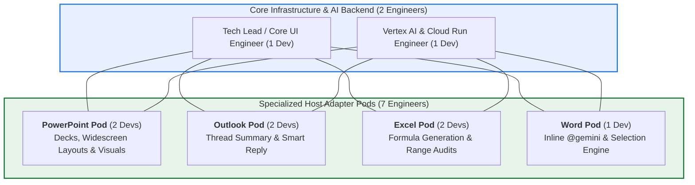

# 4–5 Week Engineering Sprint Plan: Gemini for Microsoft Office 365
**Project:** Gemini for Office 365 (Word, PowerPoint, Excel, Outlook)  
**Author:** Sathya AG, Principal Architect, Google  
**Team Size:** 9 Dedicated Resources  
**Timeline:** 5 Weeks (5 Sprints)  
**License:** Apache-2.0  

---

## 👥 1. Team Allocation (9 Resources Across 5 Pods)



| Pod | Headcount | Key Deliverables & Top Copilot Equivalent Features | Primary Files Owned |
| :--- | :---: | :--- | :--- |
| **Outlook Pod** | **2 Engineers** | • **Email Thread TL;DR:** Multi-email conversation summarization.<br>• **Smart Draft & Reply:** Context-aware email drafting with tone controls.<br>• **Action Items & Sentiment Extraction:** Next steps and follow-ups. | `src/adapters/OutlookAdapter.js`<br>`src/adapters/outlook/*` |
| **PowerPoint Pod** | **2 Engineers** | • **Briefing-to-Deck Generator:** Multi-slide presentation creation.<br>• **2D Vector Chart Injection:** Multimodal visual charts (`gemini-2.5-flash-image`).<br>• **Speaker Notes & Agenda Builder:** Auto-generated talking points. | `src/adapters/PPTAdapter.js`<br>`src/adapters/ppt/*` |
| **Excel Pod** | **2 Engineers** | • **Natural Language Formula Generator:** `=XLOOKUP`, `=SUMIFS` generation.<br>• **Outlier & Formula Risk Auditing:** Cell range anomaly detection.<br>• **Executive KPI Metric Cards:** Visual summary blocks from tables. | `src/adapters/ExcelAdapter.js`<br>`src/adapters/excel/*` |
| **Word Pod** | **1 Engineer** | • **Inline `@gemini` Execution:** Real-time in-document text generation.<br>• **Live Text Transformation:** Rewrite (Executive, Formal, Concise).<br>• **Structured OOXML Tables:** Formatted executive tables and callouts. | `src/adapters/WordAdapter.js`<br>`src/adapters/word/*` |
| **Core & Backend Pod** | **2 Engineers** | • **Vertex AI Grounding Datastores:** RAG over enterprise 10-K/10-Q & GCS.<br>• **Unified Taskpane UI:** Host-adaptive Fluent UI chat & context cards.<br>• **BaseAdapter Contract & CI/CD:** Jest mocks, build pipelines & Cloud Run. | `geminiproxy/*`<br>`src/core/*`<br>`src/taskpane/*` |

---

## 🎯 2. High-Impact "Best of Copilot" Features Selected for the 5-Week Sprint

### ✉️ Outlook Features (`OutlookAdapter.js`)
1. **Thread Summarizer (TL;DR):** Ingests complex email threads (`Office.context.mailbox.item.getConversation()`), isolates key discussions, and generates a 3-bullet executive summary.
2. **Context-Aware Smart Reply & Drafter:** Drafts high-conviction replies referencing the previous email thread and enterprise Datastore facts. Includes a tone slider (*Executive, Friendly, Direct*).
3. **Action Item & Meeting Extractor:** Highlights required commitments, deliverables, and proposed meeting times from incoming emails.

### 📊 PowerPoint Features (`PPTAdapter.js`)
1. **Unstructured Text to Executive Presentation:** Converts raw briefings or financial text into structured 4–6 slide decks (Title $\rightarrow$ Executive Summary $\rightarrow$ Data Tables $\rightarrow$ Key Takeaways).
2. **AI Visual Infographics & Charts:** Natively embeds high-resolution 2D vector comparison charts via macOS WKWebView dual-pipeline (`setSelectedDataAsync`).
3. **Speaker Talking Points:** Generates executive speaker notes for each slide.

### 📈 Excel Features (`ExcelAdapter.js`)
1. **Natural Language Formula Generator & Explainer:** Converts prompts like *"Sum revenue where region is West and margin > 20%"* into valid `=SUMIFS(...)` formulas with one-click insertion.
2. **Spreadsheet Anomaly & Risk Detection:** Scans active selections for mismatched data types, broken formulas, and statistical outliers.
3. **Executive KPI Cards:** Parses dense numerical tables into summary metric cards.

### 📄 Word Features (`WordAdapter.js`)
1. **In-Document `@gemini` Direct Trigger:** Type `@gemini draft executive summary` directly inside any document line to generate content in place.
2. **Selection Rewrite & Tone Refiner:** Highlight text $\rightarrow$ instant transformation (*Make Professional, Summarize, Expand, Bulletize*).
3. **Executive Callout & OOXML Table Injection:** Formats unstructured lists into styled Word tables with headers.

---

## 🗓️ 3. Week-by-Week Execution Roadmap (5-Week Sprint Schedule)

```mermaid
gantt
    title 5-Week Engineering Sprint Schedule
    dateFormat  YYYY-MM-DD
    
    section Sprint 1 (Week 1)
    Core: BaseAdapter Interface & Outlook Manifest Extension :active, s1_1, 2026-08-11, 2026-08-17
    Outlook: Read Thread Body & Basic Taskpane View         :active, s1_2, 2026-08-11, 2026-08-17
    PPT: Multi-slide Layout Templates (Widescreen)          :active, s1_3, 2026-08-11, 2026-08-17
    Excel: Selection Range Context & Coordinate Parser      :active, s1_4, 2026-08-11, 2026-08-17
    Word: Inline @gemini Trigger & Keyup Listeners          :active, s1_5, 2026-08-11, 2026-08-17

    section Sprint 2 (Week 2)
    Outlook: Thread Summarizer (TL;DR) & Action Item Extraction :s2_1, 2026-08-18, 2026-08-24
    PPT: AI Visual Chart Injection & Table Parser           :s2_2, 2026-08-18, 2026-08-24
    Excel: Formula Generator & Copy-to-Cell Helper          :s2_3, 2026-08-18, 2026-08-24
    Word: Selection Rewrite & Tone Modifier Engine          :s2_4, 2026-08-18, 2026-08-24
    Core: Vertex AI Search Datastore Multi-Turn Sessions    :s2_5, 2026-08-18, 2026-08-24

    section Sprint 3 (Week 3)
    Outlook: Smart Reply & Tone-Controlled Drafting          :s3_1, 2026-08-25, 2026-08-31
    PPT: Speaker Notes Generation & Split Visual Layouts     :s3_2, 2026-08-25, 2026-08-31
    Excel: Outlier Detection & KPI Metric Card Cards        :s3_3, 2026-08-25, 2026-08-31
    Word: OOXML Styled Tables & Header Formatting           :s3_4, 2026-08-25, 2026-08-31
    Core: Citation Grounding UI Chips in Taskpane           :s3_5, 2026-08-25, 2026-08-31

    section Sprint 4 (Week 4)
    Host Pods: Cross-Platform Testing (Mac, Windows, Web)   :s4_1, 2026-09-01, 2026-09-07
    Core: Performance Optimization (Latency & Token Caching):s4_2, 2026-09-01, 2026-09-07
    Security: Enterprise Secret Scan & IAM Token Hardening  :s4_3, 2026-09-01, 2026-09-07

    section Sprint 5 (Week 5)
    End-to-End User Acceptance Testing (UAT)                :s5_1, 2026-09-08, 2026-09-15
    Final Packaging, Production Cloud Run & Release Tag      :s5_2, 2026-09-08, 2026-09-15
```

---

## 🛡️ 4. Code Conflict & Dependency Elimination Rules

1. **Strict Pod File Boundaries:**
   - Outlook Pod $\rightarrow$ `src/adapters/OutlookAdapter.js`
   - PPT Pod $\rightarrow$ `src/adapters/PPTAdapter.js`
   - Excel Pod $\rightarrow$ `src/adapters/ExcelAdapter.js`
   - Word Pod $\rightarrow$ `src/adapters/WordAdapter.js`
   - Core Pod $\rightarrow$ `src/core/`, `geminiproxy/`, `src/taskpane/`
2. **Branching Strategy:**
   - Every pod branches from `main` (e.g. `feat/outlook-thread-summary`, `feat/excel-formula-gen`).
   - PRs only contain modifications to the pod's dedicated adapter directory.
3. **Immutable Contract:**
   - `BaseAdapter.js` is locked. If a pod needs a new core capability, they request it through the Core Tech Lead during the Monday sync.
