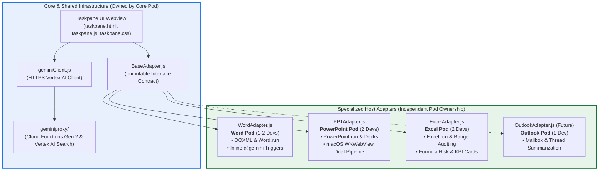
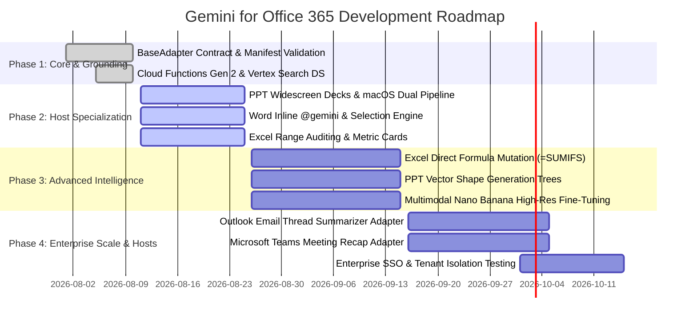

# Engineering Team Organization & Architecture Scaling Plan
**Project:** Gemini for Microsoft Office 365 (Word, PowerPoint, Excel)  
**Author:** Sathya AG, Principal Architect, Google  
**Date:** August 2026  
**License:** Apache-2.0  

---

## 📑 1. Executive Summary

This document establishes the **Engineering Team Topology, Pod Ownership, and Architecture Scaling Strategy** for developing and extending **Gemini for Microsoft Office 365**.

By utilizing the **Polymorphic Host Adapter Pattern**, the codebase achieves strict file isolation, enabling multiple specialized sub-teams (Word, PowerPoint, Excel, and AI Backend) to work in parallel on the same codebase with **zero cross-team Git merge conflicts**.

---

## 🏛️ 2. Architectural Decoupling & Isolation Model



---

## 👥 3. Team Topology & Pod Ownership Matrix

| Pod / Sub-Team | Headcount | Primary Code Ownership | Key Responsibilities |
| :--- | :---: | :--- | :--- |
| **PowerPoint Pod** | 2 Engineers | `microsoft-addin/src/adapters/PPTAdapter.js`<br>`microsoft-addin/src/adapters/ppt/*` | • Widescreen executive slide deck layout trees.<br>• Dual-pipeline macOS WKWebView base64 image injection.<br>• Data table to bullet conversions and slide styling. |
| **Excel Pod** | 2 Engineers | `microsoft-addin/src/adapters/ExcelAdapter.js`<br>`microsoft-addin/src/adapters/excel/*` | • Active cell selection analysis & range context extraction.<br>• Anomaly detection and formula risk auditing.<br>• Executive KPI summary sheets and card metric rendering. |
| **Word Pod** | 1–2 Engineers | `microsoft-addin/src/adapters/WordAdapter.js`<br>`microsoft-addin/src/adapters/word/*` | • In-document `@gemini <prompt>` inline parser and replacer.<br>• Selected text transformation (rewrite, summarize, tone change).<br>• Custom OOXML tables and corporate callout blocks. |
| **Core & AI Backend Pod** | 1–2 Engineers | `geminiproxy/*`<br>`microsoft-addin/src/core/*`<br>`microsoft-addin/src/taskpane/*` | • Vertex AI Search Datastore Grounding & tuning.<br>• Multimodal `gemini-2.5-flash-image` (Nano Banana) prompt pipeline.<br>• Taskpane UI framework and `BaseAdapter.js` contract governance. |

---

## 🛡️ 4. Dependency & Merge Conflict Mitigation Strategy

| Dependency Area | Shared Risk Level | Mitigation & Engineering Guardrail |
| :--- | :---: | :--- |
| **Host Adapters** | 🟢 **Zero Conflict** | Adapters live in strictly separate files (`WordAdapter.js`, `PPTAdapter.js`, `ExcelAdapter.js`). Devs never touch other pods' adapter files. |
| **Backend Microservice** | 🟢 **Zero Conflict** | Backend proxy lives in `geminiproxy/` and is deployed independently via Cloud Run / Cloud Functions. |
| **BaseAdapter Contract** | 🟡 **Low Risk** | `BaseAdapter.js` is treated as an immutable interface. Breaking schema changes require an RFC approved by all pod leads. |
| **Taskpane UI & Manifest** | 🟡 **Low Risk** | Event-driven UI architecture. Pods only register callbacks via `HostAdapterFactory` rather than hardcoding host logic in `taskpane.js`. |

---

## 🔒 5. Governance: GitHub CODEOWNERS & Branch Policy

To ensure clean code reviews, the repository uses a `.github/CODEOWNERS` file:

```gitignore
# Core UI & Interface Contract
/microsoft-addin/src/core/                     @cloud-gtm/core-team
/microsoft-addin/src/adapters/BaseAdapter.js   @cloud-gtm/core-team
/microsoft-addin/src/adapters/HostAdapterFactory.js @cloud-gtm/core-team
/geminiproxy/                                  @cloud-gtm/backend-team

# Specialized Pods
/microsoft-addin/src/adapters/PPTAdapter.js     @cloud-gtm/ppt-team
/microsoft-addin/src/adapters/ExcelAdapter.js   @cloud-gtm/excel-team
/microsoft-addin/src/adapters/WordAdapter.js    @cloud-gtm/word-team
```

---

## 🧪 6. Independent Mock Testing Strategy

Each pod tests its adapter in isolation using Jest mock harnesses without requiring live Office desktop installations:

```javascript
// Example Mock Test for PPTAdapter (Runs in headless CI/CD)
describe('PPTAdapter Test Suite', () => {
  it('should construct a 4-slide executive presentation', async () => {
    const mockContext = createMockPowerPointContext();
    const adapter = new PPTAdapter(mockContext);
    
    const result = await adapter.insertSlideDeck(sampleBriefingData);
    expect(result.slideCount).toBe(4);
    expect(mockContext.presentation.setSelectedSlides).toHaveBeenCalled();
  });
});
```

---

## 🗺️ 7. Phased Delivery Roadmap (4-Phase Milestones)


