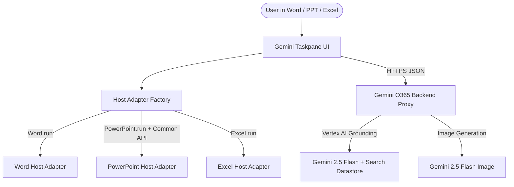

# Gemini for Microsoft 365 (Word, PowerPoint, Excel)
**Author:** Sathya AG, Principal Architect, Google  
**License:** Apache-2.0  

An enterprise-ready Microsoft 365 Add-in that brings the power of **Google Cloud Vertex AI (Gemini 2.5 Flash & Multimodal Visual Generation)** directly into Microsoft Word, PowerPoint, and Excel.

---

## 🌟 Key Features

### 📄 Microsoft Word (`WordAdapter`)
- **Interactive Document Q&A:** Full document summarization, risk analysis, and action item extraction.
- **In-Document Execution:** Type `@gemini <prompt>` directly on any document line to generate content inline.
- **Live Text Transformation:** Highlight text to rewrite, summarize, professionalize, or convert into executive tables.

### 📊 Microsoft PowerPoint (`PPTAdapter`)
- **Executive Deck Generator:** Automatically converts unstructured text and financial briefings into structured multi-slide executive decks.
- **AI Visual Chart Injection:** Generates and embeds high-resolution 2D vector charts and comparison graphics natively onto slides.
- **Dual-Pipeline macOS Compatibility:** Optimized with `PowerPoint.run` slide selection synchronization and native `Office.context.document.setSelectedDataAsync` injection to bypass macOS WKWebView sandbox restrictions.
- **Intelligent Layouts:** Dedicated center-aligned Title slides, widescreen executive layouts (880px), and split-column visual layouts (420px text + 440x340px image).

### 📈 Microsoft Excel (`ExcelAdapter`)
- **Spreadsheet Intelligence:** Summarize worksheets, extract data patterns, and generate executive KPI metric cards.
- **Anomaly & Formula Risk Detection:** Identifies outliers, formatting inconsistencies, and formula risks.
- **In-Cell Triggers:** Type `@gemini <prompt>` or cell selection analysis.

---

## 🏗️ Architecture



---

## 🚀 Quick Start & Local Development

### 1. Prerequisites
- [Node.js](https://nodejs.org/) (v20+ recommended)
- Microsoft Office 365 Desktop (Word, PowerPoint, Excel) or Office Online

### 2. Environment Configuration
Copy the configuration template:
```bash
cp .env.example .env
```
Update `.env` with your backend Cloud Function or Cloud Run endpoint:
```bash
GEMINI_PROXY_URL=https://us-central1-YOUR_GCP_PROJECT.cloudfunctions.net/askGemini
```

### 3. Install & Build
```bash
npm install
npm run build
```

### 4. Local Development Server
```bash
npm run dev-server
```
Starts the local development server with self-signed HTTPS certificates at `https://localhost:3000`.

---

## ☁️ Production Deployment & Sideloading

### Deploy Frontend to Google Cloud Run
```bash
npm run build
gcloud run deploy gemini-frontend \
  --source dist \
  --region us-central1 \
  --port 80 \
  --no-allow-unauthenticated \
  --project YOUR_GCP_PROJECT_ID

gcloud run services update gemini-frontend \
  --region us-central1 \
  --no-invoker-iam-check \
  --project YOUR_GCP_PROJECT_ID
```

### Sideloading into Microsoft Office
1. Open **Microsoft Word**, **PowerPoint**, or **Excel**.
2. Go to **Insert** > **Add-ins** > **My Add-ins**.
3. Select **Upload My Add-in** and choose `manifest.xml`.
4. The **Gemini for Microsoft 365** icon will appear on the **Home** ribbon.

---

## 🔒 Security & Compliance
- **No Hardcoded Secrets:** Production endpoints and credentials are isolated through environment variables.
- **Enterprise Isolation:** Documents and slide data remain strictly within your Google Cloud enterprise security boundary.
